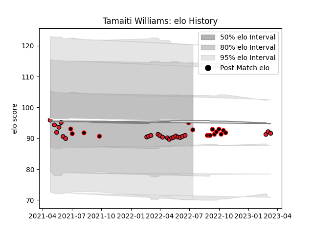

---  
layout: page  
title: Tamaiti Williams  
date: 2023-03-21 18:48:56.378705  
categories: player  
---
# Tamaiti Williams

Last updated: 2023-03-21
## Positions: P

## Country: New Zealand Maori

## Current elo: 93.0

## Current Percentile: 30.0

# Elo History

# Match History

| Team              |   Appearances |   Win Rate |
|:------------------|--------------:|-----------:|
| Crusaders         |            26 |   0.884615 |
| Canterbury        |            12 |   0.833333 |
| New Zealand Maori |             4 |   0.75     |

| Opponent                 |   Matches |   Win Rate |
|:-------------------------|----------:|-----------:|
| Chiefs                   |         4 |       0.75 |
| Blues                    |         3 |       1    |
| Queensland Reds          |         3 |       1    |
| Highlanders              |         3 |       1    |
| Auckland                 |         2 |       0.5  |
| Ireland                  |         2 |       0.5  |
| Samoa                    |         2 |       1    |
| Northland                |         2 |       1    |
| New South Wales Waratahs |         2 |       0.5  |
| Melbourne Rebels         |         2 |       1    |
| Hurricanes               |         2 |       1    |
| Fijian Drua              |         2 |       0.5  |
| Brumbies                 |         2 |       1    |
| Western Force            |         2 |       1    |
| Bay of Plenty            |         1 |       1    |
| Moana Pasifika           |         1 |       1    |
| Hawke's Bay              |         1 |       1    |
| North Harbour            |         1 |       1    |
| Otago                    |         1 |       1    |
| Counties Manukau         |         1 |       1    |
| Southland                |         1 |       1    |
| Tasman                   |         1 |       1    |
| Wellington               |         1 |       0    |