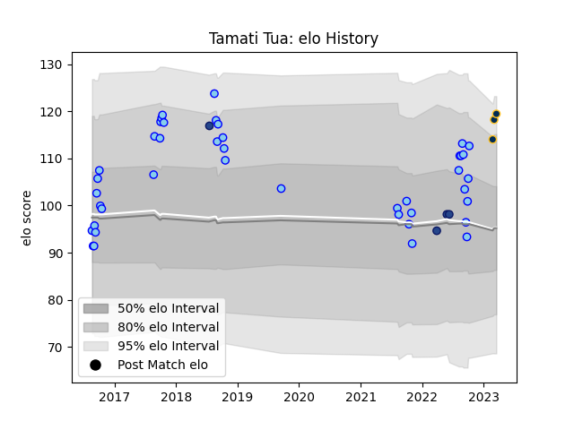

---  
layout: page  
title: Tamati Tua  
date: 2023-02-24 09:51:30.616514  
categories: player  
---
# Tamati Tua

## Positions: C

## Current elo: 113.0

## Current Percentile: 73.0

# Elo History

# Match History

| Team      |   Appearances |   Win Rate |
|:----------|--------------:|-----------:|
| Northland |            42 |   0.285714 |
| Blues     |             4 |   0.75     |

| Opponent                 |   Matches |   Win Rate |
|:-------------------------|----------:|-----------:|
| Wellington               |         5 |   0.2      |
| Bay of Plenty            |         5 |   0.4      |
| Waikato                  |         5 |   0.4      |
| Otago                    |         4 |   0.25     |
| Auckland                 |         4 |   0.25     |
| Canterbury               |         4 |   0        |
| North Harbour            |         3 |   0        |
| Southland                |         3 |   0.333333 |
| Taranaki                 |         3 |   0.666667 |
| Manawatu                 |         2 |   0.5      |
| Tasman                   |         2 |   0        |
| Crusaders                |         1 |   0        |
| Hawke's Bay              |         1 |   1        |
| Counties Manukau         |         1 |   0        |
| New South Wales Waratahs |         1 |   1        |
| Brumbies                 |         1 |   1        |
| Moana Pasifika           |         1 |   1        |