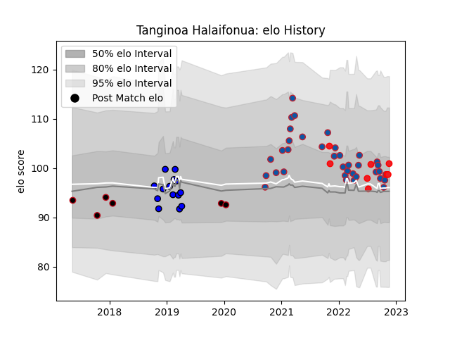

---  
layout: page  
title: Tanginoa Halaifonua  
date: 2022-12-14 11:22:37.031423  
categories: player  
---
# Tanginoa Halaifonua

## Positions: FL, L

## Country: Tonga

## Current elo: 100.0

## Current Percentile: 69.0

# Elo History

# Match History

| Team     |   Appearances |   Win Rate |
|:---------|--------------:|-----------:|
| Grenoble |            38 |   0.526316 |
| Massy    |            14 |   0.107143 |
| Tonga    |             8 |   0.5      |
| Lyon     |             6 |   0        |

| Opponent           |   Matches |   Win Rate |
|:-------------------|----------:|-----------:|
| Montauban          |         7 |   0.428571 |
| Aurillac           |         5 |   0.6      |
| Oyonnax            |         5 |   0.2      |
| Mont-de-Marsan     |         4 |   0.5      |
| Beziers            |         4 |   0.25     |
| Nevers             |         4 |   0.875    |
| Biarritz Olympique |         3 |   0.166667 |
| Carcassonne        |         3 |   0.333333 |
| Provence Rugby     |         3 |   0        |
| Soyaux-Angouleme   |         2 |   0.75     |
| Rouen              |         2 |   0.5      |
| Agen               |         2 |   0.5      |
| Brive              |         2 |   0.5      |
| Colomiers          |         2 |   0.5      |
| Cardiff Blues      |         2 |   0        |
| Vannes             |         2 |   0        |
| England            |         1 |   0        |
| Fiji               |         1 |   0        |
| Chile              |         1 |   1        |
| Perpignan          |         1 |   0        |
| Leinster           |         1 |   0        |
| Hong Kong          |         1 |   1        |
| Samoa              |         1 |   0        |
| Scotland           |         1 |   0        |
| Benetton Treviso   |         1 |   0        |
| Spain              |         1 |   1        |
| Stade Toulousain   |         1 |   0        |
| US Bressane        |         1 |   1        |
| Uruguay            |         1 |   1        |
| Grenoble           |         1 |   0        |