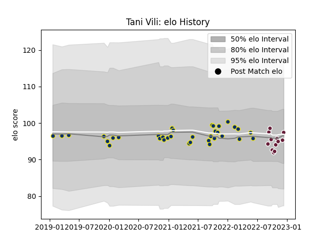

---  
layout: page  
title: Tani Vili  
date: 2022-12-18 16:31:25.793603  
categories: player  
---
# Tani Vili

## Positions: C

## Current elo: 97.0

## Current Percentile: 46.0

# Elo History

# Match History

| Team              |   Appearances |   Win Rate |
|:------------------|--------------:|-----------:|
| Clermont Auvergne |            35 |   0.557143 |
| Bordeaux Begles   |            12 |   0.458333 |

| Opponent             |   Matches |   Win Rate |
|:---------------------|----------:|-----------:|
| Toulon               |         5 |   0.6      |
| Stade Toulousain     |         4 |   0.25     |
| Bordeaux Begles      |         4 |   0.375    |
| Castres Olympique    |         4 |   0.75     |
| Stade Francais Paris |         4 |   0.75     |
| Racing 92            |         4 |   0.5      |
| Montpellier Herault  |         4 |   0.5      |
| Lyon                 |         3 |   0.333333 |
| Brive                |         3 |   0.666667 |
| Pau                  |         2 |   0.5      |
| Agen                 |         2 |   1        |
| La Rochelle          |         2 |   0.5      |
| Bayonne              |         1 |   0        |
| Gloucester Rugby     |         1 |   0        |
| Perpignan            |         1 |   0        |
| Dragons              |         1 |   1        |
| Clermont Auvergne    |         1 |   0.5      |
| Biarritz Olympique   |         1 |   1        |