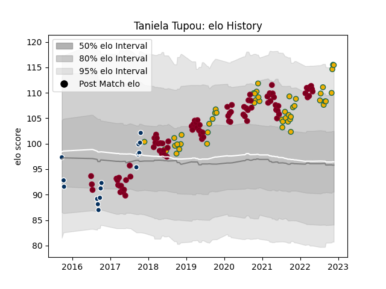

---  
layout: page  
title: Taniela Tupou  
date: 2022-11-22 11:33:31.909305  
categories: player  
---
# Taniela Tupou

## Positions: P

## Country: Australia

## Current elo: 115.0

## Current Percentile: 94.0

# Elo History

# Match History

| Team               |   Appearances |   Win Rate |
|:-------------------|--------------:|-----------:|
| Queensland Reds    |            87 |   0.431034 |
| Australia          |            50 |   0.46     |
| Queensland Country |            15 |   0.533333 |

| Opponent                 |   Matches |   Win Rate |
|:-------------------------|----------:|-----------:|
| Brumbies                 |        16 |   0.5      |
| Melbourne Rebels         |        13 |   0.653846 |
| Argentina                |        11 |   0.681818 |
| New Zealand              |        10 |   0.25     |
| New South Wales Waratahs |         9 |   0.444444 |
| South Africa             |         7 |   0.571429 |
| Western Force            |         7 |   0.571429 |
| Chiefs                   |         6 |   0.166667 |
| Crusaders                |         4 |   0        |
| Sunwolves                |         4 |   0.75     |
| France                   |         4 |   0.5      |
| Highlanders              |         4 |   0        |
| Hurricanes               |         4 |   0        |
| Ireland                  |         4 |   0.25     |
| Jaguares                 |         4 |   0.25     |
| Blues                    |         4 |   0.25     |
| Scotland                 |         3 |   0.333333 |
| Bulls                    |         3 |   0.666667 |
| England                  |         3 |   0        |
| NSW Country Eagles       |         3 |   1        |
| Lions                    |         3 |   0.333333 |
| Melbourne Rising         |         2 |   0.5      |
| Wales                    |         2 |   0        |
| Fijian Drua              |         2 |   1        |
| Stormers                 |         2 |   0.5      |
| Brisbane City            |         2 |   0.5      |
| Sharks                   |         2 |   0.5      |
| North Harbour Rays       |         2 |   0        |
| Greater Sydney Rams      |         2 |   0.5      |
| Canberra Vikings         |         2 |   0        |
| Italy                    |         2 |   0.5      |
| Georgia                  |         1 |   1        |
| Samoa                    |         1 |   1        |
| Southern Kings           |         1 |   1        |
| Sydney Rays              |         1 |   1        |
| Uruguay                  |         1 |   1        |
| Japan                    |         1 |   1        |