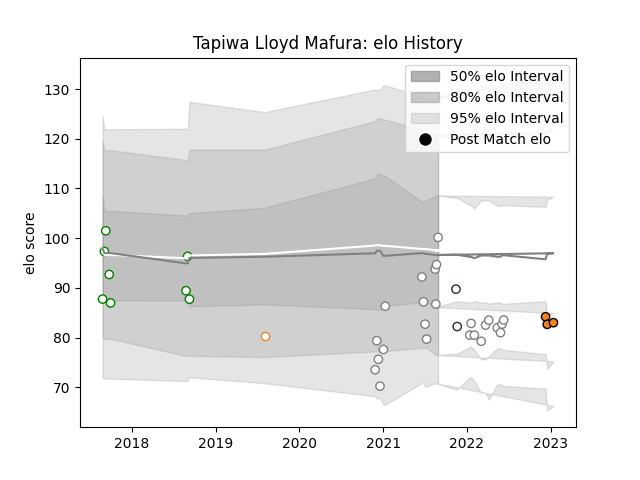

---  
layout: page  
title: Tapiwa Lloyd Mafura  
date: 2023-03-21 18:46:59.023362  
categories: player  
---
# Tapiwa Lloyd Mafura

Last updated: 2023-03-21
## Positions: FB, W

## Country: Zimbabwe

## Current elo: 100.0

## Current Percentile: 21.0

# Elo History

# Match History

| Team                |   Appearances |   Win Rate |
|:--------------------|--------------:|-----------:|
| Pumas               |            26 |   0.461538 |
| Leopards            |            11 |   0.681818 |
| Cheetahs            |             4 |   0.5      |
| Free State Cheetahs |             3 |   0.666667 |
| Zimbabwe            |             2 |   0.5      |

| Opponent               |   Matches |   Win Rate |
|:-----------------------|----------:|-----------:|
| Griquas                |         7 |   0.642857 |
| Blue Bulls             |         5 |   0.2      |
| Free State Cheetahs    |         5 |   0.6      |
| Golden Lions           |         5 |   0.6      |
| Western Province       |         4 |   0.375    |
| Griffons               |         3 |   0.333333 |
| Boland Cavaliers       |         2 |   1        |
| Eastern Province Kings |         2 |   1        |
| Natal Sharks           |         2 |   0        |
| Pau                    |         2 |   1        |
| SWD Eagles             |         2 |   0.75     |
| Scarlets               |         2 |   0        |
| Valke                  |         2 |   0.5      |
| Border Bulldogs        |         1 |   1        |
| Brazil                 |         1 |   1        |
| Namibia                |         1 |   0        |