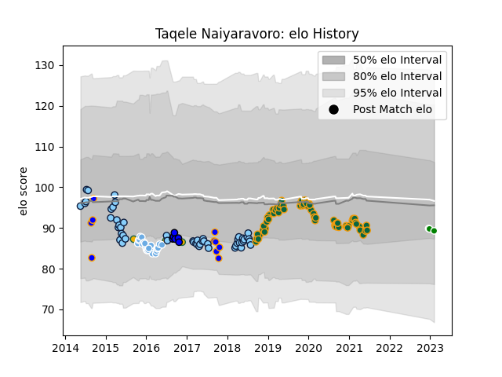

---  
layout: page  
title: Taqele Naiyaravoro  
date: 2022-12-28 12:54:44.200954  
categories: player  
---
# Taqele Naiyaravoro

## Positions: W

## Country: Australia

## Current elo: 101.0

## Current Percentile: None

# Elo History

# Match History

| Team                     |   Appearances |   Win Rate |
|:-------------------------|--------------:|-----------:|
| Northampton Saints       |            60 |   0.433333 |
| New South Wales Waratahs |            49 |   0.591837 |
| Glasgow Warriors         |            23 |   0.630435 |
| Greater Sydney Rams      |            10 |   0.5      |
| Saitama Wild Knights     |             6 |   0.666667 |
| Australia                |             3 |   0.666667 |
| Green Rockets Tokatsu    |             2 |   0.5      |

| Opponent                 |   Matches |   Win Rate |
|:-------------------------|----------:|-----------:|
| Exeter Chiefs            |         8 |   0.25     |
| Bath Rugby               |         6 |   0.166667 |
| Brumbies                 |         6 |   0.833333 |
| Queensland Reds          |         6 |   1        |
| Wasps                    |         6 |   0.666667 |
| Melbourne Rebels         |         6 |   1        |
| Bristol Rugby            |         5 |   0.2      |
| Worcester Warriors       |         5 |   1        |
| Lions                    |         5 |   0.2      |
| Highlanders              |         5 |   0.6      |
| Harlequins               |         4 |   0.5      |
| Leicester Tigers         |         4 |   0.5      |
| Sale Sharks              |         4 |   0.25     |
| Gloucester Rugby         |         4 |   0.5      |
| Dragons                  |         4 |   1        |
| Leinster                 |         3 |   0        |
| Benetton Treviso         |         3 |   1        |
| Western Force            |         3 |   0.333333 |
| Crusaders                |         3 |   0.333333 |
| Saracens                 |         3 |   0.333333 |
| Scarlets                 |         3 |   1        |
| Sunwolves                |         3 |   1        |
| Newcastle Falcons        |         2 |   0.5      |
| NSW Country Eagles       |         2 |   0.5      |
| Perth Spirit             |         2 |   0.5      |
| Northampton Saints       |         2 |   0        |
| Ospreys                  |         2 |   0.75     |
| Ulster                   |         2 |   0.5      |
| Tokyo Sungoliath         |         2 |   0        |
| Racing 92                |         2 |   0.5      |
| Zebre                    |         2 |   1        |
| Chiefs                   |         2 |   0        |
| Blues                    |         2 |   0.5      |
| Jaguares                 |         2 |   0        |
| Hurricanes               |         2 |   0        |
| Hanazono Kintetsu Liners |         2 |   1        |
| Clermont Auvergne        |         2 |   0        |
| Edinburgh                |         2 |   0        |
| Cardiff Blues            |         1 |   1        |
| Sydney Rays              |         1 |   1        |
| Sydney Stars             |         1 |   1        |
| Cheetahs                 |         1 |   1        |
| London Irish             |         1 |   0        |
| United States of America |         1 |   1        |
| Stormers                 |         1 |   0        |
| Brisbane City            |         1 |   1        |
| Yokohama Canon Eagles    |         1 |   1        |
| Canberra Vikings         |         1 |   0        |
| Sharks                   |         1 |   1        |
| Southern Kings           |         1 |   0        |
| Shizuoka Blue Revs       |         1 |   0        |
| Melbourne Rising         |         1 |   0        |
| Coca-Cola Red Sparks     |         1 |   1        |
| Connacht                 |         1 |   0        |
| England                  |         1 |   0        |
| Queensland Country       |         1 |   0        |
| France                   |         1 |   1        |
| Kobelco Kobe Steelers    |         1 |   1        |
| Munster                  |         1 |   1        |
| Lyon                     |         1 |   1        |