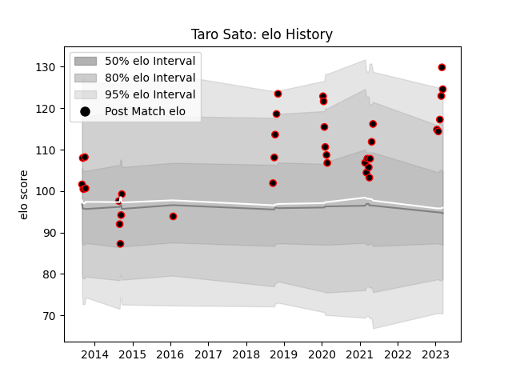

---  
layout: page  
title: Taro Sato  
date: 2023-03-21 18:10:11.630981  
categories: player  
---
# Taro Sato

Last updated: 2023-03-21
## Positions: FL

## Current elo: 125.0

## Current Percentile: 95.0

# Elo History

# Match History

| Team                            |   Appearances |   Win Rate |
|:--------------------------------|--------------:|-----------:|
| NTT Docomo Red Hurricanes Osaka |            36 |   0.444444 |

| Opponent                         |   Matches |   Win Rate |
|:---------------------------------|----------:|-----------:|
| Kobelco Kobe Steelers            |         4 |        0   |
| Kyuden Voltex                    |         3 |        1   |
| Yokohama Canon Eagles            |         2 |        0.5 |
| Saitama Wild Knights             |         2 |        0   |
| Green Rockets Tokatsu            |         2 |        0   |
| Hanazono Kintetsu Liners         |         2 |        0   |
| Toyota Verblitz                  |         2 |        0   |
| Kurita Water Gush                |         2 |        0.5 |
| Skyactivs Hiroshima              |         2 |        1   |
| Mitsubishi Dynaboars             |         2 |        1   |
| Shizuoka Blue Revs               |         2 |        0   |
| Urayasu D-Rocks                  |         1 |        0   |
| Toyota Industries Shuttles Aichi |         1 |        1   |
| Toshiba Brave Lupus Tokyo        |         1 |        0   |
| Black Rams Tokyo                 |         1 |        1   |
| Munakata Sanix Blues             |         1 |        0   |
| Chugoku Red Regulions            |         1 |        1   |
| Mazda Blue Zoomers               |         1 |        1   |
| Kamaishi Seawaves                |         1 |        1   |
| Hino Red Dolphins                |         1 |        1   |
| Coca-Cola Red Sparks             |         1 |        0   |
| Mie Honda Heat                   |         1 |        1   |