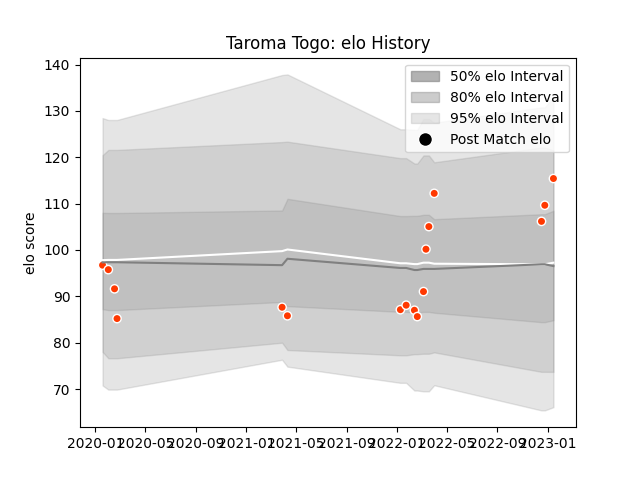

---  
layout: page  
title: Taroma Togo  
date: 2022-12-18 16:22:25.239736  
categories: player  
---
# Taroma Togo

## Positions: C, FH

## Current elo: 99.0

## Current Percentile: 54.0

# Elo History

# Match History

| Team              |   Appearances |   Win Rate |
|:------------------|--------------:|-----------:|
| Hino Red Dolphins |             7 |   0.285714 |

| Opponent                          |   Matches |   Win Rate |
|:----------------------------------|----------:|-----------:|
| Kamaishi Seawaves                 |         2 |          1 |
| Black Rams Tokyo                  |         1 |          0 |
| Hanazono Kintetsu Liners          |         1 |          0 |
| Kubota Spears Funabashi Tokyo-Bay |         1 |          0 |
| Mitsubishi Dynaboars              |         1 |          0 |
| Tokyo Sungoliath                  |         1 |          0 |