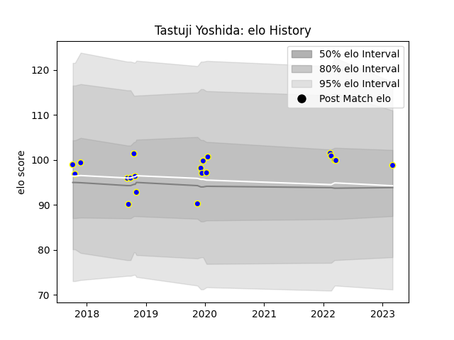

---  
layout: page  
title: Tastuji Yoshida  
date: 2023-03-09 10:12:36.414521  
categories: player  
---
# Tastuji Yoshida

## Positions: H

## Current elo: 99.0

## Current Percentile: None

# Elo History

# Match History

| Team              |   Appearances |   Win Rate |
|:------------------|--------------:|-----------:|
| Kamaishi Seawaves |            20 |      0.425 |

| Opponent                         |   Matches |   Win Rate |
|:---------------------------------|----------:|-----------:|
| Hanazono Kintetsu Liners         |         3 |        0   |
| Chugoku Red Regulions            |         2 |        1   |
| Hino Red Dolphins                |         2 |        0   |
| Kurita Water Gush                |         2 |        0.5 |
| Mazda Blue Zoomers               |         2 |        0.5 |
| Skyactivs Hiroshima              |         2 |        0.5 |
| Toyota Industries Shuttles Aichi |         2 |        0   |
| Chubu Electric Power             |         1 |        1   |
| Coca-Cola Red Sparks             |         1 |        0.5 |
| Kyuden Voltex                    |         1 |        1   |
| Mitsubishi Dynaboars             |         1 |        0   |
| Shimizu Blue Sharks              |         1 |        1   |