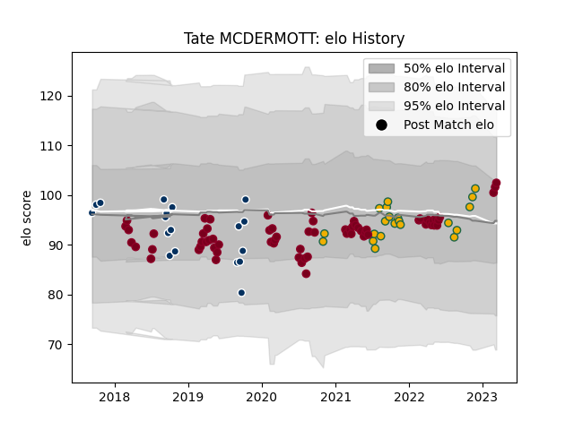

---  
layout: page  
title: Tate MCDERMOTT  
date: 2023-03-06 11:22:28.003346  
categories: player  
---
# Tate MCDERMOTT

## Positions: SH

## Country: Australia

## Current elo: 102.0

## Current Percentile: 68.0

# Elo History

# Match History

| Team               |   Appearances |   Win Rate |
|:-------------------|--------------:|-----------:|
| Queensland Reds    |            66 |   0.507576 |
| Australia          |            21 |   0.47619  |
| Queensland Country |            18 |   0.611111 |

| Opponent                 |   Matches |   Win Rate |
|:-------------------------|----------:|-----------:|
| Melbourne Rebels         |        11 |   0.681818 |
| Brumbies                 |        10 |   0.7      |
| New South Wales Waratahs |         9 |   0.555556 |
| Western Force            |         7 |   0.571429 |
| Crusaders                |         5 |   0        |
| New Zealand              |         5 |   0.2      |
| Fijian Drua              |         4 |   0.5      |
| Sunwolves                |         4 |   1        |
| Chiefs                   |         3 |   0.333333 |
| Bulls                    |         3 |   0.666667 |
| Hurricanes               |         3 |   0        |
| South Africa             |         3 |   1        |
| Blues                    |         3 |   0        |
| Brisbane City            |         3 |   0.666667 |
| Melbourne Rising         |         3 |   0.666667 |
| France                   |         3 |   0.666667 |
| Wales                    |         2 |   0.5      |
| Sydney Rays              |         2 |   0.5      |
| Stormers                 |         2 |   0.5      |
| Sharks                   |         2 |   0.5      |
| Scotland                 |         2 |   0.5      |
| Argentina                |         2 |   0.5      |
| NSW Country Eagles       |         2 |   1        |
| Jaguares                 |         2 |   0        |
| Highlanders              |         2 |   0        |
| England                  |         2 |   0        |
| Canberra Vikings         |         2 |   1        |
| Moana Pasifika           |         1 |   1        |
| Lions                    |         1 |   0        |
| Italy                    |         1 |   0        |
| Japan                    |         1 |   1        |