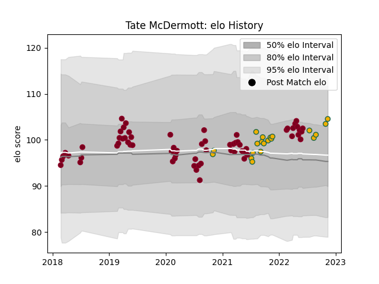

---  
layout: page  
title: Tate McDermott  
date: 2022-11-16 11:29:48.978984  
categories: player  
---
# Tate McDermott

## Positions: SH

## Country: Australia

## Current elo: 105.0

## Current Percentile: 76.0

# Elo History

# Match History

| Team            |   Appearances |   Win Rate |
|:----------------|--------------:|-----------:|
| Queensland Reds |            64 |   0.507812 |
| Australia       |            20 |   0.45     |

| Opponent                 |   Matches |   Win Rate |
|:-------------------------|----------:|-----------:|
| Melbourne Rebels         |        11 |   0.681818 |
| Brumbies                 |        10 |   0.7      |
| New South Wales Waratahs |         9 |   0.555556 |
| Crusaders                |         5 |   0        |
| New Zealand              |         5 |   0.2      |
| Western Force            |         4 |   0.75     |
| Sunwolves                |         4 |   1        |
| Bulls                    |         3 |   0.666667 |
| Chiefs                   |         3 |   0.333333 |
| France                   |         3 |   0.666667 |
| South Africa             |         3 |   1        |
| Blues                    |         3 |   0        |
| Stormers                 |         2 |   0.5      |
| Sharks                   |         2 |   0.5      |
| Scotland                 |         2 |   0.5      |
| Argentina                |         2 |   0.5      |
| Jaguares                 |         2 |   0        |
| Hurricanes               |         2 |   0        |
| Highlanders              |         2 |   0        |
| England                  |         2 |   0        |
| Moana Pasifika           |         1 |   1        |
| Lions                    |         1 |   0        |
| Italy                    |         1 |   0        |
| Wales                    |         1 |   0        |
| Japan                    |         1 |   1        |