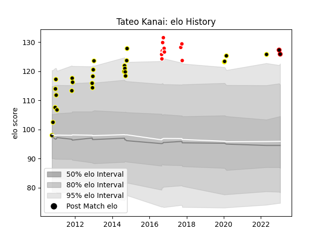

---  
layout: page  
title: Tateo Kanai  
date: 2023-01-15 11:46:14.537992  
categories: player  
---
# Tateo Kanai

## Positions: P, H

## Current elo: 126.0

## Current Percentile: None

# Elo History

# Match History

| Team                  |   Appearances |   Win Rate |
|:----------------------|--------------:|-----------:|
| Tokyo Sungoliath      |            26 |   0.884615 |
| Kobelco Kobe Steelers |            11 |   0.818182 |
| Mie Honda Heat        |             2 |   1        |

| Opponent                         |   Matches |   Win Rate |
|:---------------------------------|----------:|-----------:|
| Urayasu D-Rocks                  |         4 |   1        |
| Shizuoka Blue Revs               |         4 |   1        |
| Yokohama Canon Eagles            |         3 |   0.666667 |
| NTT Docomo Red Hurricanes Osaka  |         3 |   1        |
| Toshiba Brave Lupus Tokyo        |         3 |   0.333333 |
| Kobelco Kobe Steelers            |         3 |   0.666667 |
| Saitama Wild Knights             |         3 |   0.666667 |
| Toyota Verblitz                  |         2 |   1        |
| Toyota Industries Shuttles Aichi |         2 |   1        |
| Black Rams Tokyo                 |         2 |   1        |
| Coca-Cola Red Sparks             |         2 |   1        |
| Hino Red Dolphins                |         2 |   1        |
| Hanazono Kintetsu Liners         |         2 |   1        |
| Mie Honda Heat                   |         1 |   1        |
| Kamaishi Seawaves                |         1 |   1        |
| Green Rockets Tokatsu            |         1 |   1        |
| Munakata Sanix Blues             |         1 |   1        |