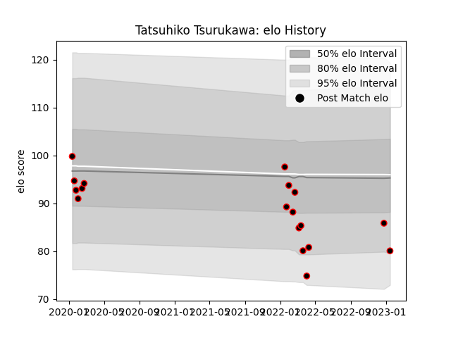

---  
layout: page  
title: Tatsuhiko Tsurukawa  
date: 2023-03-21 18:04:03.474728  
categories: player  
---
# Tatsuhiko Tsurukawa

Last updated: 2023-03-21
## Positions: P

## Current elo: 94.0

## Current Percentile: 24.0

# Elo History

# Match History

| Team           |   Appearances |   Win Rate |
|:---------------|--------------:|-----------:|
| Mie Honda Heat |            28 |   0.607143 |

| Opponent                          |   Matches |   Win Rate |
|:----------------------------------|----------:|-----------:|
| Kamaishi Seawaves                 |         4 |   1        |
| Hino Red Dolphins                 |         3 |   1        |
| Mitsubishi Dynaboars              |         3 |   0.666667 |
| Green Rockets Tokatsu             |         2 |   0.5      |
| Hanazono Kintetsu Liners          |         2 |   0        |
| Skyactivs Hiroshima               |         2 |   1        |
| Toshiba Brave Lupus Tokyo         |         2 |   0        |
| Toyota Industries Shuttles Aichi  |         2 |   1        |
| Urayasu D-Rocks                   |         2 |   0        |
| Black Rams Tokyo                  |         1 |   1        |
| Kubota Spears Funabashi Tokyo-Bay |         1 |   0        |
| NTT Docomo Red Hurricanes Osaka   |         1 |   0        |
| Shimizu Blue Sharks               |         1 |   1        |
| Toyota Verblitz                   |         1 |   0        |
| Yokohama Canon Eagles             |         1 |   1        |