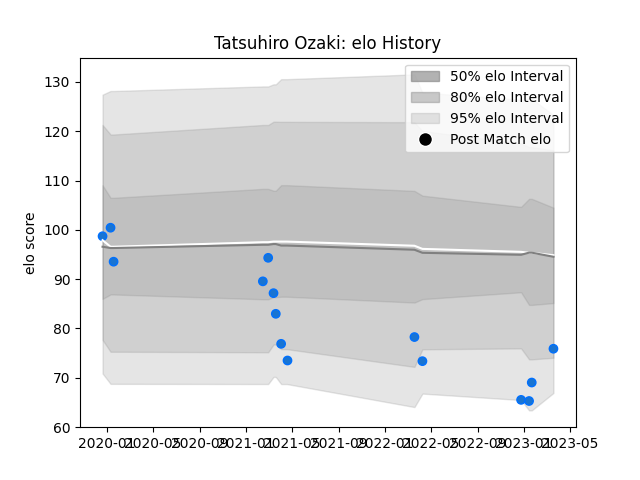

---  
layout: page  
title: Tatsuhiro Ozaki  
date: 2022-12-28 12:54:42.357567  
categories: player  
---
# Tatsuhiro Ozaki

## Positions: W, FB

## Current elo: 88.0

## Current Percentile: 39.0

# Elo History

# Match History

| Team                |   Appearances |   Win Rate |
|:--------------------|--------------:|-----------:|
| Shimizu Blue Sharks |             7 |   0.142857 |

| Opponent                         |   Matches |   Win Rate |
|:---------------------------------|----------:|-----------:|
| Toyota Industries Shuttles Aichi |         3 |          0 |
| Chugoku Red Regulions            |         1 |          1 |
| Kamaishi Seawaves                |         1 |          0 |
| Kyuden Voltex                    |         1 |          0 |
| Urayasu D-Rocks                  |         1 |          0 |