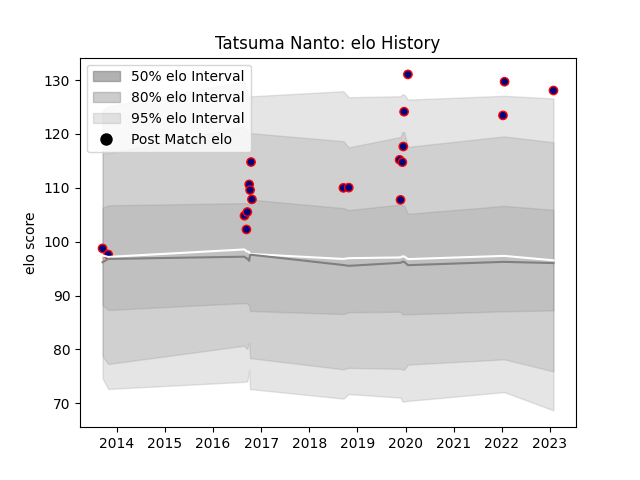

---  
layout: page  
title: Tatsuma Nanto  
date: 2023-01-30 17:54:32.736564  
categories: player  
---
# Tatsuma Nanto

## Positions: W, FB

## Current elo: 128.0

## Current Percentile: None

# Elo History

# Match History

| Team                     |   Appearances |   Win Rate |
|:-------------------------|--------------:|-----------:|
| Hanazono Kintetsu Liners |            20 |       0.55 |

| Opponent                          |   Matches |   Win Rate |
|:----------------------------------|----------:|-----------:|
| Toshiba Brave Lupus Tokyo         |         2 |          0 |
| Kyuden Voltex                     |         2 |          1 |
| Coca-Cola Red Sparks              |         2 |          1 |
| Black Rams Tokyo                  |         1 |          0 |
| Saitama Wild Knights              |         1 |          0 |
| Toyota Verblitz                   |         1 |          0 |
| Toyota Industries Shuttles Aichi  |         1 |          1 |
| Tokyo Sungoliath                  |         1 |          0 |
| Shimizu Blue Sharks               |         1 |          1 |
| Mitsubishi Dynaboars              |         1 |          0 |
| Munakata Sanix Blues              |         1 |          0 |
| Mie Honda Heat                    |         1 |          1 |
| Mazda Blue Zoomers                |         1 |          1 |
| Kurita Water Gush                 |         1 |          1 |
| Kubota Spears Funabashi Tokyo-Bay |         1 |          1 |
| Kamaishi Seawaves                 |         1 |          1 |
| Urayasu D-Rocks                   |         1 |          0 |