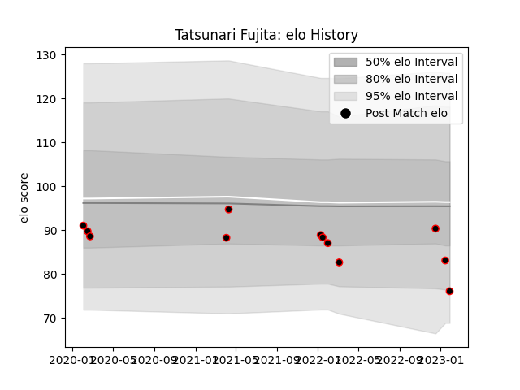

---  
layout: page  
title: Tatsunari Fujita  
date: 2023-01-17 11:46:00.523591  
categories: player  
---
# Tatsunari Fujita

## Positions: L

## Current elo: 83.0

## Current Percentile: 33.0

# Elo History

# Match History

| Team                            |   Appearances |   Win Rate |
|:--------------------------------|--------------:|-----------:|
| NTT Docomo Red Hurricanes Osaka |            11 |   0.181818 |

| Opponent                  |   Matches |   Win Rate |
|:--------------------------|----------:|-----------:|
| Shizuoka Blue Revs        |         3 |          0 |
| Kobelco Kobe Steelers     |         2 |          0 |
| Saitama Wild Knights      |         2 |          0 |
| Black Rams Tokyo          |         1 |          0 |
| Kyuden Voltex             |         1 |          1 |
| Skyactivs Hiroshima       |         1 |          1 |
| Toshiba Brave Lupus Tokyo |         1 |          0 |