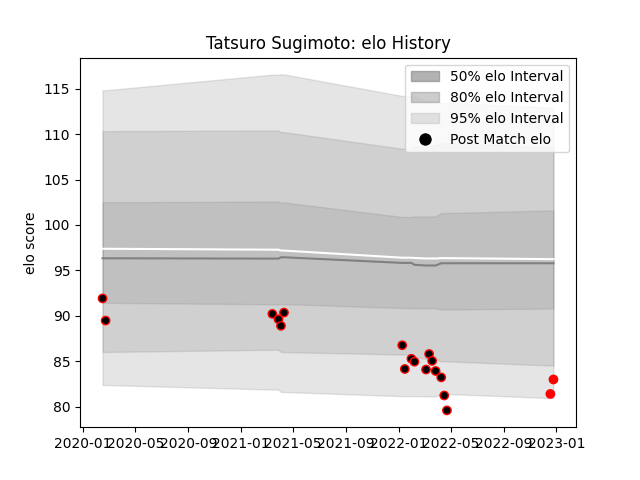

---  
layout: page  
title: Tatsuro Sugimoto  
date: 2022-12-28 12:53:01.367015  
categories: player  
---
# Tatsuro Sugimoto

## Positions: P

## Current elo: 83.0

## Current Percentile: 5.0

# Elo History

# Match History

| Team                            |   Appearances |   Win Rate |
|:--------------------------------|--------------:|-----------:|
| NTT Docomo Red Hurricanes Osaka |            17 |   0.117647 |
| Yokohama Canon Eagles           |             2 |   0.75     |

| Opponent                          |   Matches |   Win Rate |
|:----------------------------------|----------:|-----------:|
| Saitama Wild Knights              |         3 |       0    |
| Shizuoka Blue Revs                |         3 |       0    |
| Kobelco Kobe Steelers             |         2 |       0.5  |
| Kubota Spears Funabashi Tokyo-Bay |         2 |       0.25 |
| Tokyo Sungoliath                  |         2 |       0    |
| Toshiba Brave Lupus Tokyo         |         2 |       0    |
| Black Rams Tokyo                  |         1 |       0    |
| Green Rockets Tokatsu             |         1 |       1    |
| Hino Red Dolphins                 |         1 |       1    |
| Toyota Verblitz                   |         1 |       0    |
| Yokohama Canon Eagles             |         1 |       0    |