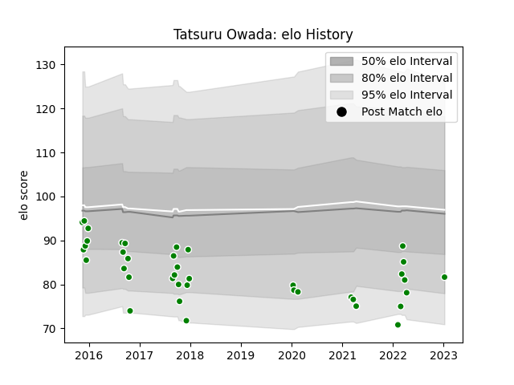

---  
layout: page  
title: Tatsuru Owada  
date: 2023-02-02 18:54:58.230221  
categories: player  
---
# Tatsuru Owada

## Positions: FL

## Current elo: 80.0

## Current Percentile: 10.0

# Elo History

# Match History

| Team                  |   Appearances |   Win Rate |
|:----------------------|--------------:|-----------:|
| Green Rockets Tokatsu |            41 |   0.195122 |

| Opponent                          |   Matches |   Win Rate |
|:----------------------------------|----------:|-----------:|
| Kobelco Kobe Steelers             |         5 |   0        |
| Shizuoka Blue Revs                |         5 |   0        |
| Yokohama Canon Eagles             |         4 |   0.25     |
| Black Rams Tokyo                  |         3 |   0        |
| NTT Docomo Red Hurricanes Osaka   |         3 |   0.166667 |
| Toyota Industries Shuttles Aichi  |         3 |   0.666667 |
| Coca-Cola Red Sparks              |         2 |   1        |
| Hino Red Dolphins                 |         2 |   0        |
| Kubota Spears Funabashi Tokyo-Bay |         2 |   0.75     |
| Munakata Sanix Blues              |         2 |   0.5      |
| Saitama Wild Knights              |         2 |   0        |
| Tokyo Sungoliath                  |         2 |   0        |
| Toshiba Brave Lupus Tokyo         |         2 |   0        |
| Toyota Verblitz                   |         2 |   0        |
| Mitsubishi Dynaboars              |         1 |   0        |
| Urayasu D-Rocks                   |         1 |   0        |