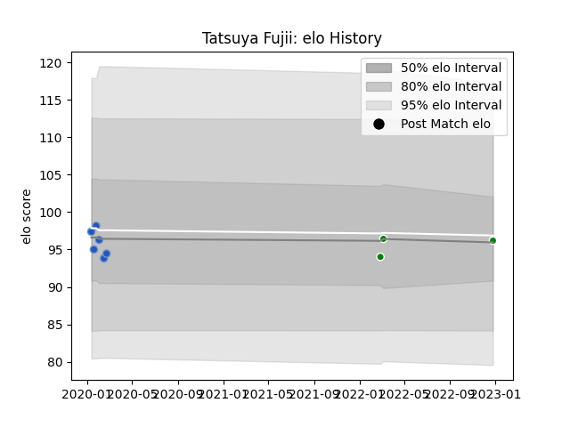

---  
layout: page  
title: Tatsuya Fujii  
date: 2023-03-17 17:20:20.391968  
categories: player  
---
# Tatsuya Fujii

## Positions: SH

## Current elo: 101.0

## Current Percentile: None

# Elo History

# Match History

| Team                  |   Appearances |   Win Rate |
|:----------------------|--------------:|-----------:|
| Munakata Sanix Blues  |            14 |   0.214286 |
| Green Rockets Tokatsu |             8 |   0        |

| Opponent                          |   Matches |   Win Rate |
|:----------------------------------|----------:|-----------:|
| Kubota Spears Funabashi Tokyo-Bay |         3 |          0 |
| Black Rams Tokyo                  |         2 |          0 |
| Shizuoka Blue Revs                |         2 |          0 |
| Tokyo Sungoliath                  |         2 |          0 |
| Toshiba Brave Lupus Tokyo         |         2 |          0 |
| Urayasu D-Rocks                   |         2 |          0 |
| Yokohama Canon Eagles             |         2 |          0 |
| Green Rockets Tokatsu             |         1 |          1 |
| Hanazono Kintetsu Liners          |         1 |          0 |
| Kobelco Kobe Steelers             |         1 |          0 |
| Mie Honda Heat                    |         1 |          1 |
| Mitsubishi Dynaboars              |         1 |          0 |
| NTT Docomo Red Hurricanes Osaka   |         1 |          1 |
| Toyota Verblitz                   |         1 |          0 |