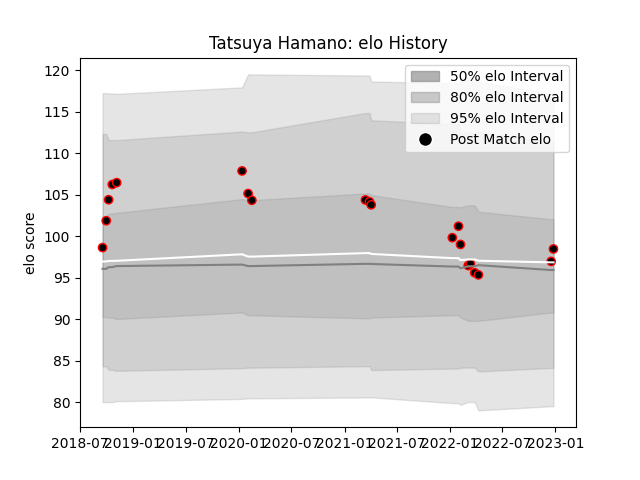

---  
layout: page  
title: Tatsuya Hamano  
date: 2022-12-28 12:55:25.619085  
categories: player  
---
# Tatsuya Hamano

## Positions: SH

## Current elo: 98.0

## Current Percentile: 55.0

# Elo History

# Match History

| Team                            |   Appearances |   Win Rate |
|:--------------------------------|--------------:|-----------:|
| NTT Docomo Red Hurricanes Osaka |            20 |        0.4 |

| Opponent                          |   Matches |   Win Rate |
|:----------------------------------|----------:|-----------:|
| Shizuoka Blue Revs                |         3 |          0 |
| Kyuden Voltex                     |         2 |          1 |
| Mitsubishi Dynaboars              |         2 |          1 |
| Saitama Wild Knights              |         2 |          0 |
| Tokyo Sungoliath                  |         2 |          0 |
| Black Rams Tokyo                  |         1 |          0 |
| Chugoku Red Regulions             |         1 |          1 |
| Hanazono Kintetsu Liners          |         1 |          0 |
| Hino Red Dolphins                 |         1 |          1 |
| Kamaishi Seawaves                 |         1 |          1 |
| Kobelco Kobe Steelers             |         1 |          0 |
| Kubota Spears Funabashi Tokyo-Bay |         1 |          0 |
| Mazda Blue Zoomers                |         1 |          1 |
| Yokohama Canon Eagles             |         1 |          0 |