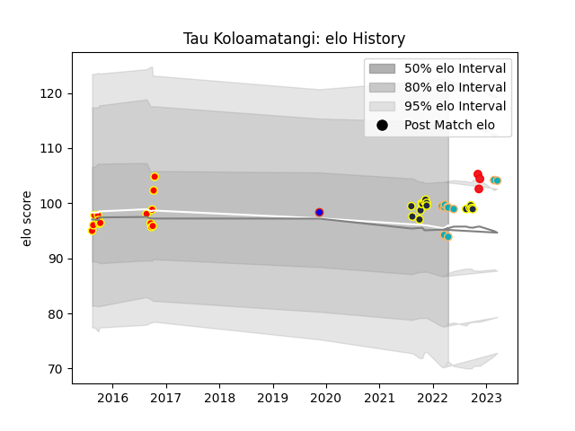

---  
layout: page  
title: Tau Koloamatangi  
date: 2022-11-22 11:38:09.655604  
categories: player  
---
# Tau Koloamatangi

## Positions: P

## Country: Tonga

## Current elo: 110.0

## Current Percentile: 89.0

# Elo History

# Match History

| Team           |   Appearances |   Win Rate |
|:---------------|--------------:|-----------:|
| Otago          |            14 |   0.5      |
| Waikato        |            14 |   0.392857 |
| Moana Pasifika |             6 |   0.166667 |
| Tonga          |             3 |   1        |
| Hong Kong      |             1 |   1        |

| Opponent         |   Matches |   Win Rate |
|:-----------------|----------:|-----------:|
| Manawatu         |         4 |   0.75     |
| Canterbury       |         4 |   0.25     |
| Hawke's Bay      |         4 |   0.75     |
| Taranaki         |         3 |   0.166667 |
| Wellington       |         3 |   0.333333 |
| Chiefs           |         2 |   0        |
| Counties Manukau |         2 |   0        |
| Waikato          |         2 |   0.5      |
| Hurricanes       |         2 |   0.5      |
| Northland        |         2 |   0.5      |
| Tasman           |         2 |   0        |
| Uruguay          |         1 |   1        |
| Bay of Plenty    |         1 |   1        |
| Spain            |         1 |   1        |
| Southland        |         1 |   1        |
| Belgium          |         1 |   1        |
| Crusaders        |         1 |   0        |
| Chile            |         1 |   1        |
| Western Force    |         1 |   0        |