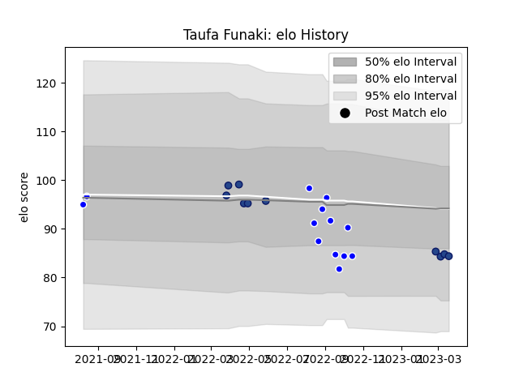

---  
layout: page  
title: Taufa Funaki  
date: 2023-03-02 11:20:47.779884  
categories: player  
---
# Taufa Funaki

## Positions: SH

## Current elo: 85.0

## Current Percentile: 20.0

# Elo History

# Match History

| Team     |   Appearances |   Win Rate |
|:---------|--------------:|-----------:|
| Auckland |            13 |   0.538462 |
| Blues    |             7 |   1        |

| Opponent                 |   Matches |   Win Rate |
|:-------------------------|----------:|-----------:|
| Canterbury               |         2 |        0.5 |
| Highlanders              |         2 |        1   |
| North Harbour            |         2 |        1   |
| Tasman                   |         2 |        0.5 |
| Bay of Plenty            |         1 |        0   |
| Crusaders                |         1 |        1   |
| Fijian Drua              |         1 |        1   |
| Moana Pasifika           |         1 |        1   |
| New South Wales Waratahs |         1 |        1   |
| Northland                |         1 |        0   |
| Otago                    |         1 |        1   |
| Southland                |         1 |        1   |
| Taranaki                 |         1 |        1   |
| Waikato                  |         1 |        0   |
| Wellington               |         1 |        0   |
| Western Force            |         1 |        1   |