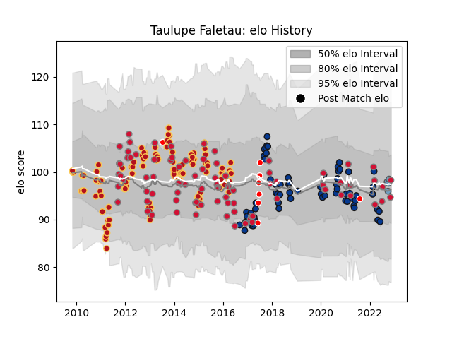

---  
layout: page  
title: Taulupe Faletau  
date: 2023-02-02 19:11:34.460983  
categories: player  
---
# Taulupe Faletau

## Positions: N8

## Country: Wales

## Current elo: 94.0

## Current Percentile: 39.0

# Elo History

# Match History

| Team                    |   Appearances |   Win Rate |
|:------------------------|--------------:|-----------:|
| Dragons                 |           111 |   0.355856 |
| Wales                   |            89 |   0.488764 |
| Bath Rugby              |            66 |   0.515152 |
| Cardiff Blues           |            10 |   0.7      |
| British and Irish Lions |             9 |   0.722222 |

| Opponent             |   Matches |   Win Rate |
|:---------------------|----------:|-----------:|
| Ospreys              |        13 |   0.307692 |
| Scarlets             |        13 |   0.230769 |
| France               |        12 |   0.5      |
| Wasps                |        11 |   0.181818 |
| Ireland              |        11 |   0.590909 |
| South Africa         |        11 |   0.363636 |
| Cardiff Blues        |        11 |   0.363636 |
| England              |        11 |   0.363636 |
| Australia            |        10 |   0.1      |
| Italy                |        10 |   0.9      |
| Gloucester Rugby     |        10 |   0.55     |
| New Zealand          |        10 |   0.15     |
| Edinburgh            |        10 |   0.4      |
| Leicester Tigers     |         9 |   0.555556 |
| Scotland             |         8 |   0.75     |
| Sale Sharks          |         7 |   0.571429 |
| Connacht             |         7 |   0.142857 |
| Benetton Treviso     |         7 |   0.714286 |
| Munster              |         7 |   0.571429 |
| Exeter Chiefs        |         6 |   0        |
| Northampton Saints   |         6 |   0.5      |
| Bristol Rugby        |         6 |   0.333333 |
| Saracens             |         5 |   0.5      |
| Ulster               |         5 |   0        |
| Harlequins           |         5 |   0.6      |
| Leinster             |         4 |   0.25     |
| Newcastle Falcons    |         4 |   0.75     |
| Worcester Warriors   |         4 |   0.5      |
| Zebre                |         4 |   0.875    |
| Argentina            |         3 |   0.666667 |
| Fiji                 |         3 |   1        |
| London Irish         |         3 |   1        |
| Stade Francais Paris |         3 |   0.666667 |
| Glasgow Warriors     |         3 |   0        |
| Samoa                |         2 |   0.5      |
| Perpignan            |         2 |   0.5      |
| Pau                  |         2 |   1        |
| Dragons              |         2 |   1        |
| Georgia              |         2 |   0.5      |
| Bordeaux Begles      |         2 |   0.5      |
| Bayonne              |         2 |   0        |
| Bath Rugby           |         2 |   0        |
| Mogliano             |         2 |   1        |
| Brive                |         2 |   1        |
| Bucuresti            |         1 |   1        |
| Toulon               |         1 |   0        |
| Stade Toulousain     |         1 |   0        |
| Provincial Union XV  |         1 |   1        |
| Castres Olympique    |         1 |   1        |
| Cavalieri Prato      |         1 |   1        |
| Crusaders            |         1 |   1        |
| Lions                |         1 |   0        |
| New Zealand Maori    |         1 |   1        |
| Namibia              |         1 |   1        |
| Japan                |         1 |   1        |
| Montpellier Herault  |         1 |   0        |
| Aironi               |         1 |   1        |