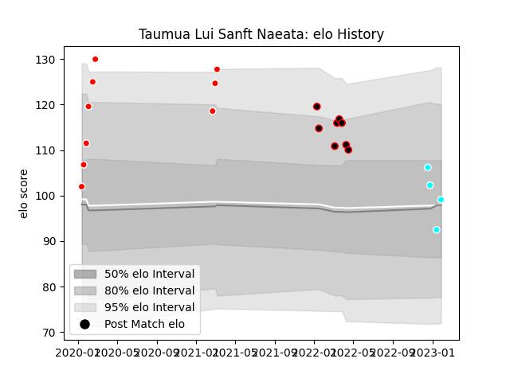

---  
layout: page  
title: Taumua Lui Sanft Naeata  
date: 2022-12-28 12:57:40.055044  
categories: player  
---
# Taumua Lui Sanft Naeata

## Positions: N8

## Current elo: 97.0

## Current Percentile: 60.0

# Elo History

# Match History

| Team                             |   Appearances |   Win Rate |
|:---------------------------------|--------------:|-----------:|
| Kobelco Kobe Steelers            |             9 |      1     |
| NTT Docomo Red Hurricanes Osaka  |             8 |      0.125 |
| Toyota Industries Shuttles Aichi |             2 |      1     |

| Opponent                          |   Matches |   Win Rate |
|:----------------------------------|----------:|-----------:|
| Yokohama Canon Eagles             |         3 |   0.666667 |
| Black Rams Tokyo                  |         2 |   0.5      |
| Green Rockets Tokatsu             |         2 |   1        |
| Hino Red Dolphins                 |         2 |   1        |
| Tokyo Sungoliath                  |         2 |   0.5      |
| Toshiba Brave Lupus Tokyo         |         2 |   0.5      |
| Kubota Spears Funabashi Tokyo-Bay |         1 |   0        |
| NTT Docomo Red Hurricanes Osaka   |         1 |   1        |
| Saitama Wild Knights              |         1 |   0        |
| Shimizu Blue Sharks               |         1 |   1        |
| Shizuoka Blue Revs                |         1 |   1        |
| Toyota Verblitz                   |         1 |   0        |