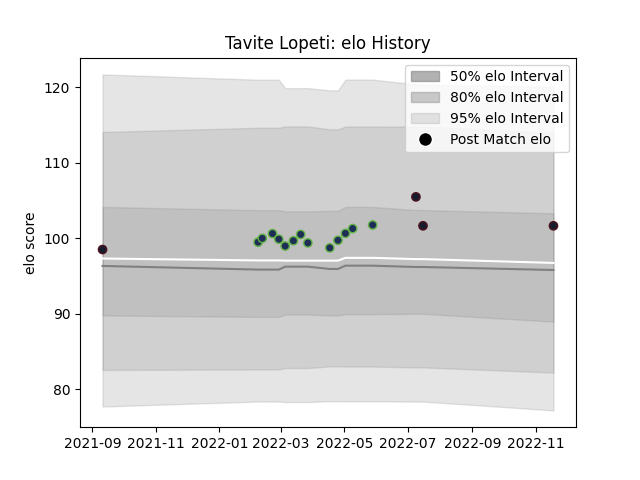

---  
layout: page  
title: Tavite Lopeti  
date: 2022-11-22 11:39:46.339174  
categories: player  
---
# Tavite Lopeti

## Positions: C

## Country: United States of America

## Current elo: 102.0

## Current Percentile: 70.0

# Elo History

# Match History

| Team                     |   Appearances |   Win Rate |
|:-------------------------|--------------:|-----------:|
| Seattle Seawolves        |            13 |   0.615385 |
| United States of America |             4 |   0.625    |

| Opponent          |   Matches |   Win Rate |
|:------------------|----------:|-----------:|
| Austin Gilgronis  |         2 |        0   |
| Chile             |         2 |        0.5 |
| Dallas Jackals    |         2 |        1   |
| Houston SaberCats |         2 |        0.5 |
| San Diego Legion  |         2 |        1   |
| Utah Warriors     |         2 |        1   |
| Canada            |         1 |        1   |
| L. A. Giltinis    |         1 |        0   |
| NOLA Gold         |         1 |        0   |
| Portugal          |         1 |        0.5 |
| Toronto Arrows    |         1 |        1   |