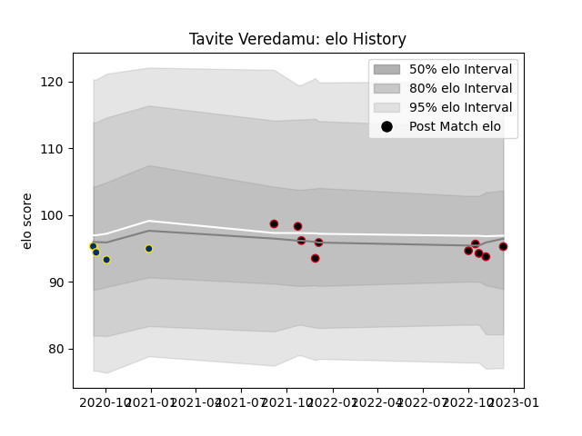

---  
layout: page  
title: Tavite Veredamu  
date: 2023-02-02 18:52:29.803013  
categories: player  
---
# Tavite Veredamu

## Positions: W, C

## Current elo: 88.0

## Current Percentile: 14.0

# Elo History

# Match History

| Team              |   Appearances |   Win Rate |
|:------------------|--------------:|-----------:|
| Lyon              |            16 |     0.4375 |
| Clermont Auvergne |             4 |     0.5    |

| Opponent             |   Matches |   Win Rate |
|:---------------------|----------:|-----------:|
| Clermont Auvergne    |         3 |   0.666667 |
| Toulon               |         3 |   0        |
| Brive                |         2 |   0.5      |
| Montpellier Herault  |         2 |   0.5      |
| Pau                  |         2 |   1        |
| Saracens             |         2 |   0        |
| Agen                 |         1 |   1        |
| Bayonne              |         1 |   0        |
| Bulls                |         1 |   0        |
| Castres Olympique    |         1 |   1        |
| Stade Francais Paris |         1 |   0        |
| Stade Toulousain     |         1 |   1        |