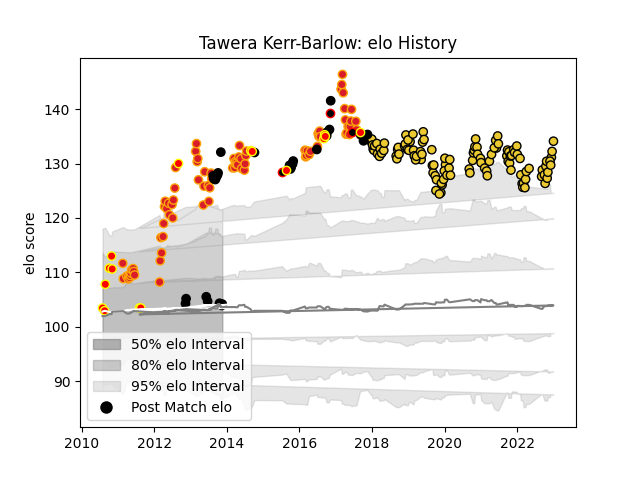

---  
layout: page  
title: Tawera Kerr-Barlow  
date: 2023-02-02 18:41:41.306800  
categories: player  
---
# Tawera Kerr-Barlow

## Positions: SH

## Country: New Zealand

## Current elo: 95.0

## Current Percentile: 96.0

# Elo History

# Match History

| Team              |   Appearances |   Win Rate |
|:------------------|--------------:|-----------:|
| La Rochelle       |           115 |   0.569565 |
| Chiefs            |            82 |   0.682927 |
| New Zealand       |            29 |   0.965517 |
| Waikato           |            16 |   0.71875  |
| New Zealand Maori |             3 |   0.666667 |

| Opponent                 |   Matches |   Win Rate |
|:-------------------------|----------:|-----------:|
| Crusaders                |        13 |   0.461538 |
| Racing 92                |        11 |   0.545455 |
| Stade Toulousain         |        10 |   0.1      |
| Highlanders              |        10 |   0.6      |
| Hurricanes               |        10 |   0.65     |
| Blues                    |         9 |   0.944444 |
| Bordeaux Begles          |         9 |   0.666667 |
| Montpellier Herault      |         8 |   0.375    |
| Toulon                   |         8 |   0.625    |
| Castres Olympique        |         7 |   0.714286 |
| Lyon                     |         7 |   0.714286 |
| Pau                      |         7 |   0.857143 |
| Stade Francais Paris     |         7 |   0.428571 |
| Clermont Auvergne        |         7 |   0.285714 |
| Brive                    |         6 |   1        |
| South Africa             |         6 |   0.833333 |
| Stormers                 |         6 |   0.666667 |
| France                   |         5 |   1        |
| Agen                     |         5 |   0.8      |
| Australia                |         5 |   1        |
| Lions                    |         4 |   0.75     |
| Western Force            |         4 |   0.75     |
| Cheetahs                 |         4 |   0.875    |
| New South Wales Waratahs |         4 |   0.5      |
| Bulls                    |         4 |   0.625    |
| Brumbies                 |         4 |   0.5      |
| Argentina                |         4 |   1        |
| Counties Manukau         |         3 |   1        |
| Queensland Reds          |         3 |   0.666667 |
| Perpignan                |         3 |   0.666667 |
| Bayonne                  |         3 |   0.333333 |
| Manawatu                 |         3 |   0.666667 |
| Ulster                   |         3 |   0.666667 |
| North Harbour            |         2 |   1        |
| Southern Kings           |         2 |   1        |
| Sale Sharks              |         2 |   0.5      |
| Bristol Rugby            |         2 |   0.5      |
| Northampton Saints       |         2 |   1        |
| Biarritz Olympique       |         2 |   0.5      |
| Auckland                 |         2 |   1        |
| Italy                    |         2 |   1        |
| Melbourne Rebels         |         2 |   1        |
| Sharks                   |         2 |   1        |
| Taranaki                 |         1 |   0.5      |
| Tonga                    |         1 |   1        |
| Bay of Plenty            |         1 |   1        |
| United States of America |         1 |   1        |
| Wales                    |         1 |   1        |
| Wellington               |         1 |   0        |
| Tasman                   |         1 |   0        |
| Oyonnax                  |         1 |   0.5      |
| Scotland                 |         1 |   1        |
| Scarlets                 |         1 |   0        |
| British and Irish Lions  |         1 |   0        |
| England                  |         1 |   1        |
| Otago                    |         1 |   1        |
| Namibia                  |         1 |   1        |
| Japan                    |         1 |   1        |
| Jaguares                 |         1 |   1        |
| Canterbury               |         1 |   0        |
| Harlequins               |         1 |   1        |
| Grenoble                 |         1 |   1        |
| Glasgow Warriors         |         1 |   0        |
| Georgia                  |         1 |   1        |
| Fiji                     |         1 |   1        |
| Zebre                    |         1 |   1        |