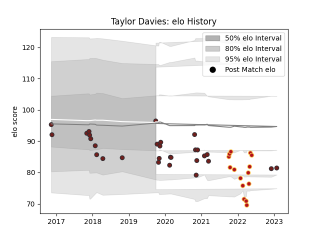

---  
layout: page  
title: Taylor Davies  
date: 2022-12-09 13:14:27.793332  
categories: player  
---
# Taylor Davies

## Positions: H

## Current elo: 83.0

## Current Percentile: 13.0

# Elo History

# Match History

| Team     |   Appearances |   Win Rate |
|:---------|--------------:|-----------:|
| Scarlets |            27 |   0.518519 |
| Dragons  |            15 |   0.166667 |

| Opponent         |   Matches |   Win Rate |
|:-----------------|----------:|-----------:|
| Benetton Treviso |         6 |   0.75     |
| Edinburgh        |         6 |   0.166667 |
| Zebre            |         3 |   0.666667 |
| Southern Kings   |         3 |   1        |
| Munster          |         3 |   0        |
| Leinster         |         2 |   0        |
| Ulster           |         2 |   0        |
| Scarlets         |         2 |   0.5      |
| Lions            |         2 |   0        |
| Connacht         |         2 |   1        |
| Cheetahs         |         2 |   0.5      |
| Harlequins       |         1 |   0        |
| Dragons          |         1 |   0        |
| London Irish     |         1 |   1        |
| Ospreys          |         1 |   0        |
| Sharks           |         1 |   0        |
| Cardiff Blues    |         1 |   0        |
| Stormers         |         1 |   0        |
| Bulls            |         1 |   0        |
| Bath Rugby       |         1 |   1        |