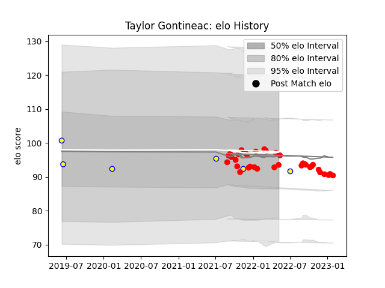

---  
layout: page  
title: Taylor Gontineac  
date: 2022-11-22 11:42:48.074205  
categories: player  
---
# Taylor Gontineac

## Positions: C

## Country: Romania

## Current elo: 96.0

## Current Percentile: 58.0

# Elo History

# Match History

| Team    |   Appearances |   Win Rate |
|:--------|--------------:|-----------:|
| Rouen   |            21 |   0.452381 |
| Romania |             5 |   0.4      |

| Opponent         |   Matches |   Win Rate |
|:-----------------|----------:|-----------:|
| Colomiers        |         3 |   0.333333 |
| Nevers           |         3 |   0        |
| Vannes           |         2 |   1        |
| Oyonnax          |         2 |   0.5      |
| Grenoble         |         2 |   0        |
| Aurillac         |         2 |   0.5      |
| Narbonne         |         1 |   1        |
| US Bressane      |         1 |   0.5      |
| Soyaux-Angouleme |         1 |   1        |
| Portugal         |         1 |   0        |
| Argentina        |         1 |   0        |
| Mont-de-Marsan   |         1 |   1        |
| Italy            |         1 |   0        |
| Chile            |         1 |   1        |
| Carcassonne      |         1 |   0        |
| Brazil           |         1 |   1        |
| Bayonne          |         1 |   0        |
| Massy            |         1 |   1        |