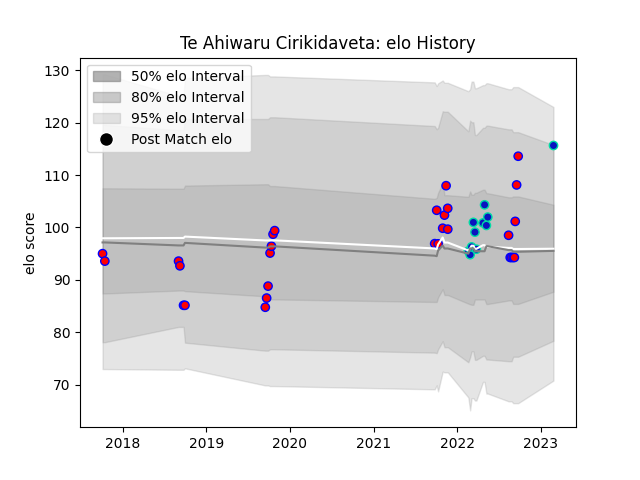

---  
layout: page  
title: Te Ahiwaru Cirikidaveta  
date: 2023-03-02 11:25:06.684840  
categories: player  
---
# Te Ahiwaru Cirikidaveta

## Positions: N8, L

## Current elo: 116.0

## Current Percentile: 89.0

# Elo History

# Match History

| Team        |   Appearances |   Win Rate |
|:------------|--------------:|-----------:|
| Tasman      |            29 |   0.586207 |
| Fijian Drua |            11 |   0.272727 |

| Opponent                 |   Matches |   Win Rate |
|:-------------------------|----------:|-----------:|
| Auckland                 |         4 |   0.5      |
| Wellington               |         4 |   0.75     |
| Waikato                  |         4 |   0.25     |
| North Harbour            |         4 |   0.75     |
| Hawke's Bay              |         3 |   0.666667 |
| Melbourne Rebels         |         2 |   0.5      |
| Northland                |         2 |   1        |
| Moana Pasifika           |         2 |   1        |
| Counties Manukau         |         2 |   0.5      |
| Canterbury               |         2 |   0        |
| Manawatu                 |         1 |   1        |
| Hurricanes               |         1 |   0        |
| Blues                    |         1 |   0        |
| New South Wales Waratahs |         1 |   0        |
| Highlanders              |         1 |   0        |
| Otago                    |         1 |   0        |
| Queensland Reds          |         1 |   0        |
| Southland                |         1 |   1        |
| Taranaki                 |         1 |   1        |
| Brumbies                 |         1 |   0        |
| Western Force            |         1 |   0        |