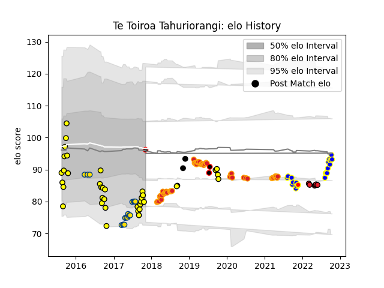

---  
layout: page  
title: Te Toiroa Tahuriorangi  
date: 2023-03-21 18:22:32.533446  
categories: player  
---
# Te Toiroa Tahuriorangi

Last updated: 2023-03-21
## Positions: SH

## Country: New Zealand Maori

## Current elo: 96.0

## Current Percentile: 12.0

# Elo History

# Match History

| Team              |   Appearances |   Win Rate |
|:------------------|--------------:|-----------:|
| Chiefs            |            48 |   0.5625   |
| Taranaki          |            36 |   0.625    |
| Bay of Plenty     |            19 |   0.526316 |
| Hurricanes        |            18 |   0.75     |
| Crusaders         |             6 |   0.666667 |
| New Zealand       |             3 |   1        |
| New Zealand Maori |             3 |   0.666667 |
| Waikato           |             2 |   1        |

| Opponent                 |   Matches |   Win Rate |
|:-------------------------|----------:|-----------:|
| Crusaders                |        10 |   0.4      |
| Highlanders              |         8 |   0.5625   |
| Blues                    |         8 |   0.75     |
| Tasman                   |         8 |   0.375    |
| Hurricanes               |         8 |   0.4375   |
| Waikato                  |         7 |   0.5      |
| Brumbies                 |         6 |   0.666667 |
| Canterbury               |         6 |   0.333333 |
| Queensland Reds          |         5 |   1        |
| Wellington               |         5 |   0.4      |
| Auckland                 |         5 |   0.6      |
| Counties Manukau         |         5 |   0.8      |
| Southland                |         4 |   1        |
| Hawke's Bay              |         4 |   0.75     |
| Bay of Plenty            |         4 |   0.75     |
| Chiefs                   |         3 |   0        |
| Jaguares                 |         3 |   0.333333 |
| Bulls                    |         3 |   1        |
| Sunwolves                |         3 |   0.666667 |
| New South Wales Waratahs |         3 |   0.666667 |
| Sharks                   |         2 |   0.5      |
| Fiji                     |         2 |   0.5      |
| Taranaki                 |         2 |   0.5      |
| Manawatu                 |         2 |   1        |
| Stormers                 |         2 |   1        |
| Northland                |         2 |   1        |
| Otago                    |         2 |   0.5      |
| Western Force            |         2 |   1        |
| Southern Kings           |         1 |   1        |
| Argentina                |         1 |   1        |
| North Harbour            |         1 |   1        |
| Moana Pasifika           |         1 |   1        |
| Melbourne Rebels         |         1 |   1        |
| Lions                    |         1 |   0        |
| Italy                    |         1 |   1        |
| Cheetahs                 |         1 |   1        |
| Canada                   |         1 |   1        |
| British and Irish Lions  |         1 |   0.5      |
| Japan                    |         1 |   1        |