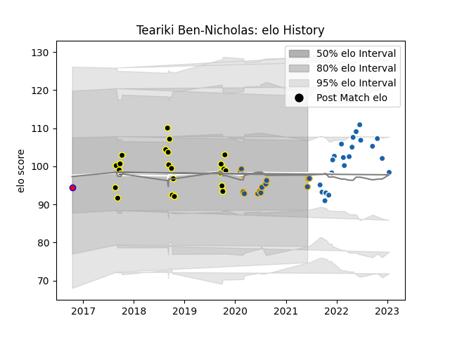

---  
layout: page  
title: Teariki Ben-Nicholas  
date: 2023-01-17 11:37:38.762266  
categories: player  
---
# Teariki Ben-Nicholas

## Positions: N8

## Current elo: 95.0

## Current Percentile: None

# Elo History

# Match History

| Team              |   Appearances |   Win Rate |
|:------------------|--------------:|-----------:|
| Wellington        |            23 |   0.73913  |
| Castres Olympique |            21 |   0.5      |
| Highlanders       |            14 |   0.357143 |
| Tasman            |             1 |   0.5      |

| Opponent                 |   Matches |   Win Rate |
|:-------------------------|----------:|-----------:|
| Auckland                 |         3 |   0.333333 |
| Crusaders                |         3 |   0        |
| Otago                    |         3 |   1        |
| North Harbour            |         3 |   0.5      |
| Waikato                  |         3 |   0.666667 |
| Montpellier Herault      |         2 |   0        |
| Blues                    |         2 |   0        |
| Bordeaux Begles          |         2 |   0.25     |
| Canterbury               |         2 |   1        |
| Racing 92                |         2 |   0.5      |
| Biarritz Olympique       |         2 |   1        |
| Lyon                     |         2 |   0.5      |
| La Rochelle              |         2 |   0        |
| Hurricanes               |         2 |   0.5      |
| Southland                |         2 |   1        |
| Stade Toulousain         |         2 |   1        |
| Brumbies                 |         2 |   1        |
| Taranaki                 |         2 |   1        |
| Tasman                   |         2 |   0        |
| Toulon                   |         2 |   0.5      |
| Sharks                   |         1 |   0        |
| Perpignan                |         1 |   1        |
| Pau                      |         1 |   1        |
| Bulls                    |         1 |   0        |
| Northland                |         1 |   1        |
| New South Wales Waratahs |         1 |   1        |
| Melbourne Rebels         |         1 |   0        |
| Hawke's Bay              |         1 |   1        |
| Harlequins               |         1 |   0        |
| Edinburgh                |         1 |   0        |
| Counties Manukau         |         1 |   1        |
| Clermont Auvergne        |         1 |   1        |
| Chiefs                   |         1 |   1        |
| Manawatu                 |         1 |   1        |