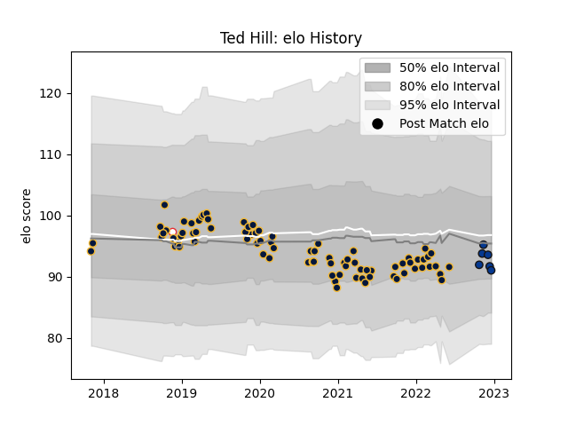

---  
layout: page  
title: Ted Hill  
date: 2023-02-02 18:41:09.209937  
categories: player  
---
# Ted Hill

## Positions: FL

## Country: England

## Current elo: 92.0

## Current Percentile: 49.0

# Elo History

# Match History

| Team               |   Appearances |   Win Rate |
|:-------------------|--------------:|-----------:|
| Worcester Warriors |            82 |   0.323171 |
| Bath Rugby         |            11 |   0.409091 |
| England            |             2 |   1        |

| Opponent                 |   Matches |   Win Rate |
|:-------------------------|----------:|-----------:|
| Harlequins               |         9 |   0.333333 |
| Leicester Tigers         |         8 |   0.5      |
| Sale Sharks              |         8 |   0.375    |
| Northampton Saints       |         8 |   0.125    |
| Bath Rugby               |         7 |   0.285714 |
| Exeter Chiefs            |         7 |   0.142857 |
| Saracens                 |         6 |   0.333333 |
| Newcastle Falcons        |         6 |   0.416667 |
| Bristol Rugby            |         6 |   0.333333 |
| London Irish             |         6 |   0.666667 |
| Gloucester Rugby         |         5 |   0.2      |
| Wasps                    |         5 |   0.2      |
| Ospreys                  |         3 |   0.666667 |
| Glasgow Warriors         |         2 |   0.25     |
| Castres Olympique        |         2 |   0        |
| Toulon                   |         2 |   0        |
| Japan                    |         1 |   1        |
| Pau                      |         1 |   1        |
| Dragons                  |         1 |   0        |
| Stade Francais Paris     |         1 |   1        |
| United States of America |         1 |   1        |