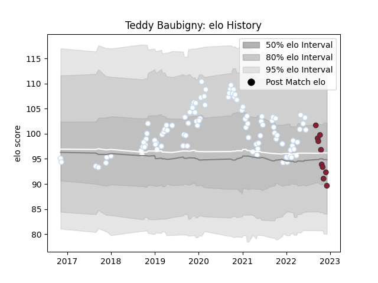

---  
layout: page  
title: Teddy Baubigny  
date: 2023-01-17 11:36:17.232267  
categories: player  
---
# Teddy Baubigny

## Positions: H

## Current elo: 92.0

## Current Percentile: 73.0

# Elo History

# Match History

| Team      |   Appearances |   Win Rate |
|:----------|--------------:|-----------:|
| Racing 92 |            98 |   0.668367 |
| Toulon    |            13 |   0.615385 |

| Opponent             |   Matches |   Win Rate |
|:---------------------|----------:|-----------:|
| Castres Olympique    |        10 |   0.7      |
| Montpellier Herault  |         9 |   0.777778 |
| Stade Francais Paris |         8 |   0.875    |
| Bordeaux Begles      |         8 |   0.25     |
| Clermont Auvergne    |         8 |   0.8125   |
| La Rochelle          |         8 |   0.5      |
| Lyon                 |         7 |   0.428571 |
| Pau                  |         6 |   0.833333 |
| Stade Toulousain     |         6 |   0.333333 |
| Agen                 |         5 |   0.9      |
| Toulon               |         5 |   0.8      |
| Brive                |         4 |   1        |
| Perpignan            |         3 |   0.333333 |
| Bayonne              |         3 |   0.333333 |
| Saracens             |         3 |   0.666667 |
| Ulster               |         2 |   0.5      |
| Scarlets             |         2 |   1        |
| Munster              |         2 |   0.75     |
| Oyonnax              |         2 |   1        |
| Ospreys              |         2 |   1        |
| Bath Rugby           |         2 |   1        |
| Biarritz Olympique   |         2 |   0.5      |
| Racing 92            |         1 |   0        |
| Grenoble             |         1 |   1        |
| Exeter Chiefs        |         1 |   0        |
| Zebre                |         1 |   1        |