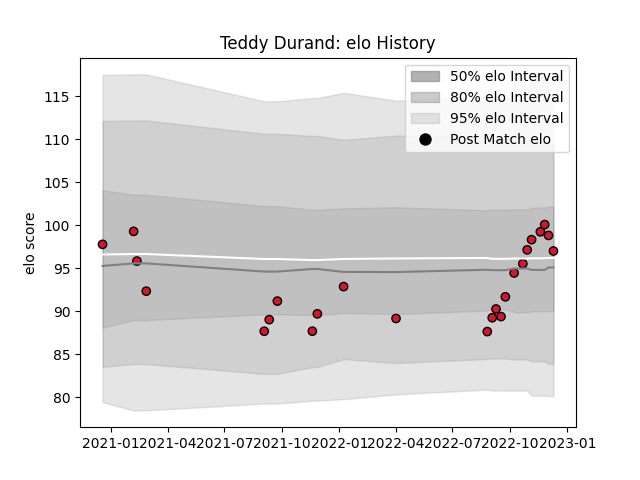

---  
layout: page  
title: Teddy Durand  
date: 2023-02-03 10:25:38.412383  
categories: player  
---
# Teddy Durand

## Positions: H

## Current elo: 72.0

## Current Percentile: 11.0

# Elo History

# Match History

| Team    |   Appearances |   Win Rate |
|:--------|--------------:|-----------:|
| Oyonnax |            51 |   0.656863 |

| Opponent                   |   Matches |   Win Rate |
|:---------------------------|----------:|-----------:|
| Rouen                      |         5 |   0.4      |
| Nevers                     |         4 |   0.75     |
| Beziers                    |         4 |   0.875    |
| Mont-de-Marsan             |         4 |   0.375    |
| Vannes                     |         3 |   0.666667 |
| Soyaux-Angouleme           |         3 |   1        |
| Biarritz Olympique         |         3 |   0        |
| Carcassonne                |         3 |   1        |
| Grenoble                   |         3 |   1        |
| Provence Rugby             |         3 |   0.5      |
| Aurillac                   |         3 |   0.666667 |
| Agen                       |         2 |   1        |
| Narbonne                   |         2 |   1        |
| Bayonne                    |         2 |   0.5      |
| Montauban                  |         2 |   0.5      |
| Perpignan                  |         1 |   0        |
| Massy                      |         1 |   1        |
| Colomiers                  |         1 |   0        |
| US Bressane                |         1 |   1        |
| Valence Romans Drome Rugby |         1 |   1        |