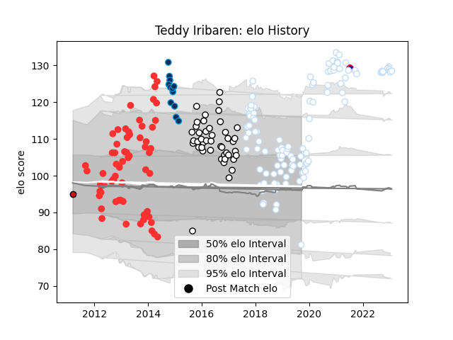

---  
layout: page  
title: Teddy Iribaren  
date: 2022-12-09 13:15:15.951540  
categories: player  
---
# Teddy Iribaren

## Positions: SH

## Country: France

## Current elo: 123.0

## Current Percentile: 96.0

# Elo History

# Match History

| Team                |   Appearances |   Win Rate |
|:--------------------|--------------:|-----------:|
| Racing 92           |           104 |   0.596154 |
| Brive               |            43 |   0.534884 |
| Tarbes              |            43 |   0.593023 |
| Montpellier Herault |            12 |   0.25     |
| France              |             3 |   0.333333 |
| Stade Toulousain    |             1 |   1        |

| Opponent             |   Matches |   Win Rate |
|:---------------------|----------:|-----------:|
| La Rochelle          |        17 |   0.352941 |
| Lyon                 |        13 |   0.423077 |
| Stade Toulousain     |        13 |   0.346154 |
| Castres Olympique    |        12 |   0.5      |
| Pau                  |        11 |   0.636364 |
| Toulon               |        10 |   0.7      |
| Bordeaux Begles      |         9 |   0.555556 |
| Montpellier Herault  |         8 |   0.75     |
| Stade Francais Paris |         8 |   0.375    |
| Oyonnax              |         7 |   0.785714 |
| Clermont Auvergne    |         7 |   0.571429 |
| Agen                 |         7 |   0.642857 |
| Grenoble             |         6 |   0.666667 |
| Bayonne              |         5 |   0.6      |
| Brive                |         5 |   0.8      |
| Carcassonne          |         4 |   0.5      |
| Racing 92            |         4 |   0.5      |
| Munster              |         4 |   0.625    |
| Leicester Tigers     |         4 |   1        |
| Saracens             |         3 |   0.666667 |
| Dax                  |         3 |   0.666667 |
| Albi                 |         3 |   0.666667 |
| Australia            |         3 |   0.333333 |
| Mont-de-Marsan       |         3 |   0.333333 |
| Auch                 |         3 |   0.666667 |
| Colomiers            |         3 |   0.666667 |
| Narbonne             |         3 |   0.666667 |
| Perpignan            |         3 |   1        |
| US Bressane          |         2 |   0.5      |
| Provence Rugby       |         2 |   1        |
| Scarlets             |         2 |   1        |
| Ulster               |         2 |   0.5      |
| Massy                |         2 |   1        |
| Glasgow Warriors     |         2 |   0        |
| Connacht             |         2 |   0.5      |
| Beziers              |         2 |   0.5      |
| Bath Rugby           |         2 |   0        |
| Ospreys              |         1 |   1        |
| Newcastle Falcons    |         1 |   0        |
| Périgueux            |         1 |   1        |
| Exeter Chiefs        |         1 |   0        |
| Bourgoin-Jallieu     |         1 |   1        |
| Biarritz Olympique   |         1 |   0        |
| Leinster             |         1 |   0        |