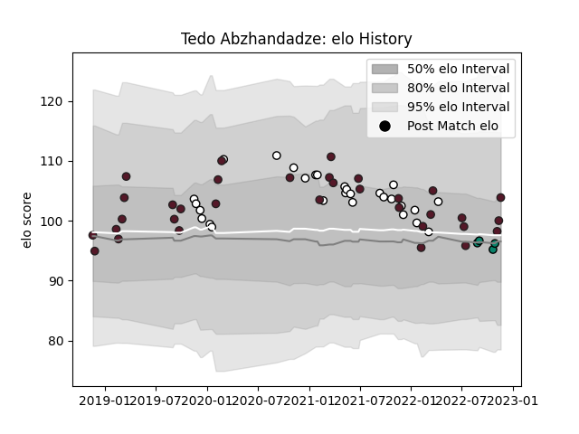

---  
layout: page  
title: Tedo Abzhandadze  
date: 2022-11-15 23:44:55.289717  
categories: player  
---
# Tedo Abzhandadze

## Positions: FH

## Country: Georgia

## Current elo: 100.0

## Current Percentile: 58.0

# Elo History

# Match History

| Team      |   Appearances |   Win Rate |
|:----------|--------------:|-----------:|
| Georgia   |            32 |   0.71875  |
| Brive     |            28 |   0.357143 |
| Montauban |             4 |   0.25     |

| Opponent             |   Matches |   Win Rate |
|:---------------------|----------:|-----------:|
| Romania              |         4 |   1        |
| Spain                |         4 |   1        |
| Zebre                |         3 |   0.333333 |
| Scotland             |         3 |   0        |
| Lyon                 |         3 |   0.333333 |
| Stade Francais Paris |         3 |   0.666667 |
| Russia               |         3 |   1        |
| Castres Olympique    |         2 |   0        |
| Samoa                |         2 |   0.5      |
| Portugal             |         2 |   0.75     |
| Pau                  |         2 |   1        |
| Netherlands          |         2 |   1        |
| Belgium              |         2 |   1        |
| Uruguay              |         2 |   1        |
| Bordeaux Begles      |         2 |   0.5      |
| Bristol Rugby        |         2 |   0        |
| Toulon               |         2 |   0.5      |
| La Rochelle          |         2 |   0.5      |
| South Africa         |         1 |   0        |
| Wales                |         1 |   0        |
| Saracens             |         1 |   0        |
| Stade Toulousain     |         1 |   0        |
| Tonga                |         1 |   1        |
| Argentina            |         1 |   0        |
| Racing 92            |         1 |   0        |
| Provence Rugby       |         1 |   0        |
| Bayonne              |         1 |   1        |
| Montpellier Herault  |         1 |   0        |
| Italy                |         1 |   1        |
| Grenoble             |         1 |   0        |
| Germany              |         1 |   1        |
| France               |         1 |   0        |
| Fiji                 |         1 |   0.5      |
| Edinburgh            |         1 |   0        |
| Carcassonne          |         1 |   0        |
| Biarritz Olympique   |         1 |   0        |
| Nevers               |         1 |   1        |