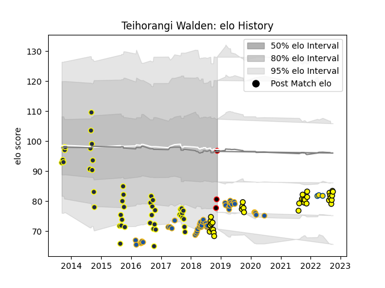

---  
layout: page  
title: Teihorangi Walden  
date: 2023-03-17 17:08:27.583728  
categories: player  
---
# Teihorangi Walden

## Positions: C

## Country: New Zealand Maori

## Current elo: 97.0

## Current Percentile: 14.0

# Elo History

# Match History

| Team              |   Appearances |   Win Rate |
|:------------------|--------------:|-----------:|
| Otago             |            46 |   0.478261 |
| Highlanders       |            40 |   0.6125   |
| Taranaki          |            34 |   0.470588 |
| Hurricanes        |             3 |   0.333333 |
| New Zealand Maori |             3 |   1        |

| Opponent                 |   Matches |   Win Rate |
|:-------------------------|----------:|-----------:|
| Bay of Plenty            |         9 |   0.333333 |
| Auckland                 |         7 |   0.285714 |
| Wellington               |         7 |   0.428571 |
| Southland                |         7 |   0.857143 |
| North Harbour            |         7 |   0.428571 |
| Manawatu                 |         7 |   0.857143 |
| Tasman                   |         6 |   0.166667 |
| Canterbury               |         6 |   0.166667 |
| Crusaders                |         6 |   0.333333 |
| Hawke's Bay              |         6 |   0.333333 |
| Hurricanes               |         5 |   0.4      |
| Waikato                  |         5 |   0.4      |
| Northland                |         5 |   0.6      |
| Melbourne Rebels         |         4 |   0.5      |
| Blues                    |         4 |   0.75     |
| Chiefs                   |         4 |   0.625    |
| Counties Manukau         |         4 |   0.5      |
| Bulls                    |         3 |   0.666667 |
| Otago                    |         3 |   1        |
| Brumbies                 |         3 |   1        |
| Lions                    |         2 |   0.5      |
| Moana Pasifika           |         2 |   0.5      |
| New South Wales Waratahs |         2 |   0.5      |
| Queensland Reds          |         2 |   1        |
| Sunwolves                |         2 |   1        |
| British and Irish Lions  |         1 |   1        |
| Brazil                   |         1 |   1        |
| United States of America |         1 |   1        |
| Sharks                   |         1 |   0        |
| Taranaki                 |         1 |   1        |
| Stormers                 |         1 |   1        |
| Chile                    |         1 |   1        |
| Western Force            |         1 |   0        |