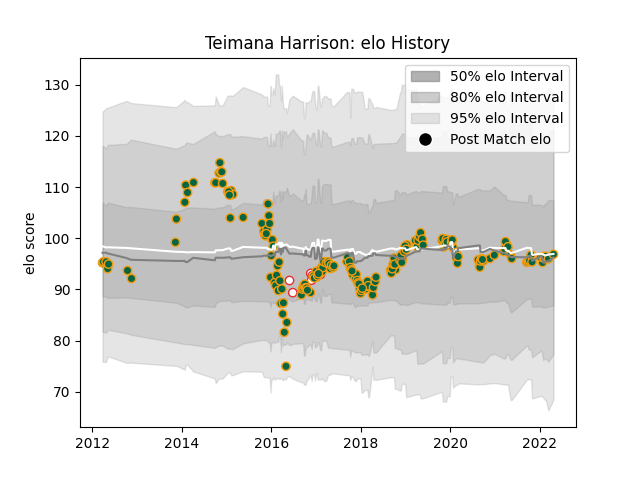

---  
layout: page  
title: Teimana Harrison  
date: 2023-02-28 11:02:57.727988  
categories: player  
---
# Teimana Harrison

## Positions: N8, FL

## Country: England

## Current elo: 97.0

## Current Percentile: 50.0

# Elo History

# Match History

| Team               |   Appearances |   Win Rate |
|:-------------------|--------------:|-----------:|
| Northampton Saints |           180 |   0.508333 |
| England            |             6 |   1        |

| Opponent             |   Matches |   Win Rate |
|:---------------------|----------:|-----------:|
| Worcester Warriors   |        15 |   0.866667 |
| Exeter Chiefs        |        15 |   0.333333 |
| Bath Rugby           |        14 |   0.5      |
| Wasps                |        14 |   0.357143 |
| Sale Sharks          |        14 |   0.357143 |
| Harlequins           |        13 |   0.615385 |
| Leicester Tigers     |        13 |   0.307692 |
| Gloucester Rugby     |        12 |   0.666667 |
| Saracens             |        11 |   0.272727 |
| London Irish         |        10 |   0.7      |
| Newcastle Falcons    |         8 |   0.375    |
| Bristol Rugby        |         5 |   0.6      |
| Clermont Auvergne    |         5 |   0.2      |
| Dragons              |         5 |   1        |
| Racing 92            |         3 |   0.166667 |
| Ospreys              |         3 |   0.333333 |
| Leinster             |         3 |   0        |
| Australia            |         2 |   1        |
| Lyon                 |         2 |   1        |
| Montpellier Herault  |         2 |   0.5      |
| Glasgow Warriors     |         2 |   1        |
| Castres Olympique    |         2 |   0.5      |
| Scarlets             |         2 |   1        |
| Ulster               |         2 |   0        |
| Benetton Treviso     |         2 |   1        |
| London Welsh         |         1 |   1        |
| France               |         1 |   1        |
| Fiji                 |         1 |   1        |
| Connacht             |         1 |   1        |
| Stade Francais Paris |         1 |   1        |
| Wales                |         1 |   1        |
| Argentina            |         1 |   1        |