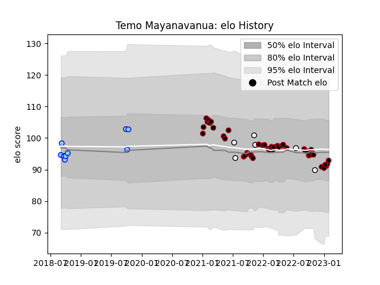

---  
layout: page  
title: Temo Mayanavanua  
date: 2023-02-02 19:02:32.472422  
categories: player  
---
# Temo Mayanavanua

## Positions: L

## Country: Fiji

## Current elo: 93.0

## Current Percentile: 36.0

# Elo History

# Match History

| Team      |   Appearances |   Win Rate |
|:----------|--------------:|-----------:|
| Lyon      |            45 |   0.511111 |
| Northland |             9 |   0.444444 |
| Fiji      |             6 |   0.166667 |

| Opponent             |   Matches |   Win Rate |
|:---------------------|----------:|-----------:|
| Pau                  |         5 |   0.6      |
| Montpellier Herault  |         5 |   0.8      |
| Clermont Auvergne    |         5 |   0.4      |
| Brive                |         5 |   0.8      |
| Castres Olympique    |         3 |   0        |
| Stade Francais Paris |         3 |   0.666667 |
| Stade Toulousain     |         3 |   0.666667 |
| Bordeaux Begles      |         3 |   0.333333 |
| La Rochelle          |         2 |   0        |
| New Zealand          |         2 |   0        |
| Otago                |         2 |   0.5      |
| Perpignan            |         2 |   0.5      |
| Racing 92            |         2 |   0        |
| Saracens             |         2 |   0        |
| Tasman               |         1 |   0        |
| Taranaki             |         1 |   1        |
| Southland            |         1 |   1        |
| Toulon               |         1 |   0        |
| Wales                |         1 |   0        |
| Spain                |         1 |   1        |
| Agen                 |         1 |   1        |
| Scotland             |         1 |   0        |
| Samoa                |         1 |   0        |
| Bay of Plenty        |         1 |   0        |
| Hawke's Bay          |         1 |   0        |
| Counties Manukau     |         1 |   1        |
| Bulls                |         1 |   1        |
| Biarritz Olympique   |         1 |   1        |
| Bayonne              |         1 |   1        |
| Wellington           |         1 |   0        |