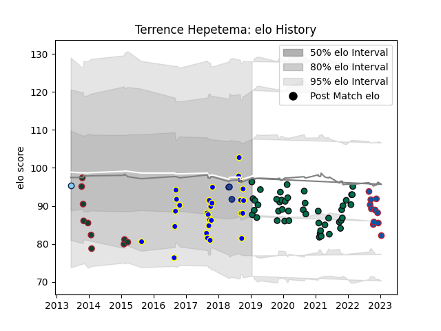

---  
layout: page  
title: Terrence Hepetema  
date: 2022-12-14 11:29:05.385867  
categories: player  
---
# Terrence Hepetema

## Positions: C

## Current elo: 86.0

## Current Percentile: 23.0

# Elo History

# Match History

| Team                     |   Appearances |   Win Rate |
|:-------------------------|--------------:|-----------:|
| London Irish             |            44 |   0.5      |
| Bay of Plenty            |            28 |   0.446429 |
| Grenoble                 |            10 |   0.65     |
| Leicester Tigers         |            10 |   0.3      |
| Blues                    |             3 |   0.333333 |
| New South Wales Waratahs |             1 |   1        |

| Opponent                 |   Matches |   Win Rate |
|:-------------------------|----------:|-----------:|
| Gloucester Rugby         |         6 |   0.416667 |
| Wasps                    |         5 |   0.4      |
| Otago                    |         5 |   0.4      |
| Sale Sharks              |         4 |   0.25     |
| Leicester Tigers         |         4 |   0.25     |
| Bristol Rugby            |         4 |   0.5      |
| Exeter Chiefs            |         3 |   0.333333 |
| Counties Manukau         |         3 |   0.5      |
| Northampton Saints       |         3 |   0.666667 |
| Saracens                 |         3 |   0.5      |
| Harlequins               |         3 |   0.333333 |
| Northland                |         3 |   0.666667 |
| Taranaki                 |         3 |   0.333333 |
| Bath Rugby               |         3 |   0        |
| Wellington               |         3 |   0        |
| Southland                |         2 |   1        |
| North Harbour            |         2 |   0.5      |
| Waikato                  |         2 |   0.5      |
| Hawke's Bay              |         2 |   0.5      |
| Richmond                 |         1 |   1        |
| Oyonnax                  |         1 |   0        |
| Pau                      |         1 |   1        |
| Provence Rugby           |         1 |   0        |
| Western Force            |         1 |   1        |
| Rouen                    |         1 |   1        |
| Worcester Warriors       |         1 |   0        |
| Soyaux-Angouleme         |         1 |   1        |
| Scarlets                 |         1 |   0        |
| Ulster                   |         1 |   0        |
| Toulon                   |         1 |   0        |
| Auckland                 |         1 |   0        |
| New South Wales Waratahs |         1 |   1        |
| Nottingham               |         1 |   1        |
| Newcastle Falcons        |         1 |   1        |
| Bayonne                  |         1 |   1        |
| Bedford                  |         1 |   1        |
| Benetton Treviso         |         1 |   1        |
| Beziers                  |         1 |   1        |
| Biarritz Olympique       |         1 |   0.5      |
| Canterbury               |         1 |   0        |
| Carcassonne              |         1 |   1        |
| Cardiff Blues            |         1 |   1        |
| Coventry                 |         1 |   1        |
| Doncaster                |         1 |   1        |
| Jaguares                 |         1 |   0        |
| Jersey                   |         1 |   1        |
| Manawatu                 |         1 |   1        |
| Melbourne Rebels         |         1 |   0        |
| Mont-de-Marsan           |         1 |   0        |
| Montauban                |         1 |   1        |
| Aurillac                 |         1 |   1        |
| Yorkshire Carnegie       |         1 |   0        |