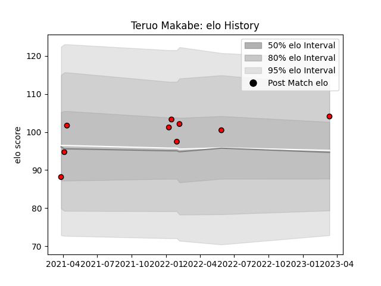

---  
layout: page  
title: Teruo Makabe  
date: 2023-03-21 18:41:35.713814  
categories: player  
---
# Teruo Makabe

Last updated: 2023-03-21
## Positions: P

## Current elo: 104.0

## Current Percentile: None

# Elo History

# Match History

| Team                      |   Appearances |   Win Rate |
|:--------------------------|--------------:|-----------:|
| Toshiba Brave Lupus Tokyo |             9 |   0.555556 |

| Opponent                          |   Matches |   Win Rate |
|:----------------------------------|----------:|-----------:|
| Green Rockets Tokatsu             |         1 |          1 |
| Kubota Spears Funabashi Tokyo-Bay |         1 |          0 |
| Mie Honda Heat                    |         1 |          1 |
| Munakata Sanix Blues              |         1 |          1 |
| NTT Docomo Red Hurricanes Osaka   |         1 |          1 |
| Shizuoka Blue Revs                |         1 |          1 |
| Tokyo Sungoliath                  |         1 |          0 |
| Toyota Verblitz                   |         1 |          0 |
| Urayasu D-Rocks                   |         1 |          0 |