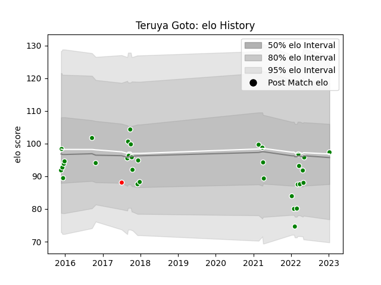

---  
layout: page  
title: Teruya Goto  
date: 2023-02-02 19:04:42.707328  
categories: player  
---
# Teruya Goto

## Positions: W

## Current elo: 91.0

## Current Percentile: 41.0

# Elo History

# Match History

| Team                  |   Appearances |   Win Rate |
|:----------------------|--------------:|-----------:|
| Green Rockets Tokatsu |            36 |   0.194444 |
| Sunwolves             |             1 |   0        |

| Opponent                          |   Matches |   Win Rate |
|:----------------------------------|----------:|-----------:|
| Kobelco Kobe Steelers             |         5 |   0        |
| Kubota Spears Funabashi Tokyo-Bay |         4 |   0.375    |
| Shizuoka Blue Revs                |         4 |   0        |
| Yokohama Canon Eagles             |         4 |   0        |
| Black Rams Tokyo                  |         3 |   0        |
| NTT Docomo Red Hurricanes Osaka   |         3 |   0.166667 |
| Saitama Wild Knights              |         3 |   0        |
| Coca-Cola Red Sparks              |         2 |   1        |
| Toyota Industries Shuttles Aichi  |         2 |   1        |
| Toyota Verblitz                   |         2 |   0        |
| Lions                             |         1 |   0        |
| Munakata Sanix Blues              |         1 |   1        |
| Tokyo Sungoliath                  |         1 |   0        |
| Toshiba Brave Lupus Tokyo         |         1 |   0        |
| Urayasu D-Rocks                   |         1 |   0        |