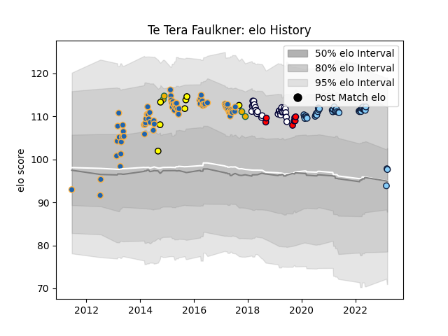

---  
layout: page  
title: Te Tera Faulkner  
date: 2023-03-17 17:05:03.452612  
categories: player  
---
# Te Tera Faulkner

## Positions: P

## Country: Australia

## Current elo: 98.0

## Current Percentile: 89.0

# Elo History

# Match History

| Team                     |   Appearances |   Win Rate |
|:-------------------------|--------------:|-----------:|
| Western Force            |            70 |   0.321429 |
| New South Wales Waratahs |            40 |   0.35     |
| Melbourne Rebels         |            29 |   0.413793 |
| Melbourne Rising         |             7 |   0.285714 |
| Perth Spirit             |             7 |   0.571429 |
| Australia                |             4 |   0.5      |

| Opponent                 |   Matches |   Win Rate |
|:-------------------------|----------:|-----------:|
| Queensland Reds          |        18 |   0.527778 |
| Melbourne Rebels         |        16 |   0.375    |
| Brumbies                 |        16 |   0.25     |
| New South Wales Waratahs |        10 |   0.4      |
| Highlanders              |         8 |   0.5      |
| Hurricanes               |         8 |   0        |
| Chiefs                   |         8 |   0.125    |
| Crusaders                |         8 |   0.25     |
| Blues                    |         7 |   0        |
| Western Force            |         6 |   0.666667 |
| Bulls                    |         6 |   0.166667 |
| Fijian Drua              |         5 |   0.6      |
| Sharks                   |         5 |   0.2      |
| Sunwolves                |         4 |   1        |
| Stormers                 |         4 |   0        |
| Cheetahs                 |         4 |   0.25     |
| Queensland Country       |         3 |   0.666667 |
| Lions                    |         3 |   0.333333 |
| Melbourne Rising         |         2 |   1        |
| Canberra Vikings         |         2 |   0        |
| Brisbane City            |         2 |   0        |
| Southern Kings           |         2 |   0.5      |
| Jaguares                 |         2 |   0.5      |
| Moana Pasifika           |         1 |   1        |
| North Harbour Rays       |         1 |   0        |
| Scotland                 |         1 |   0        |
| Ireland                  |         1 |   0        |
| Sydney Rays              |         1 |   1        |
| Sydney Stars             |         1 |   1        |
| Wales                    |         1 |   1        |
| Argentina                |         1 |   1        |