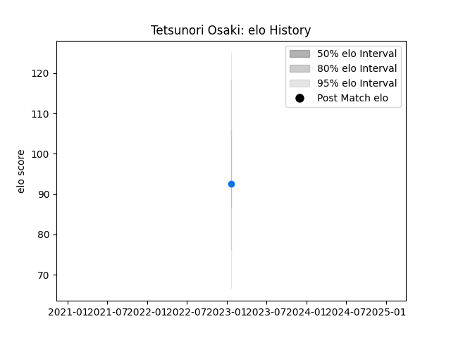

---  
layout: page  
title: Tetsunori Osaki  
date: 2023-03-21 18:57:18.265001  
categories: player  
---
# Tetsunori Osaki

Last updated: 2023-03-21
## Positions: FL, L

## Current elo: 96.0

## Current Percentile: 31.0

# Elo History

# Match History

| Team                |   Appearances |   Win Rate |
|:--------------------|--------------:|-----------:|
| Shimizu Blue Sharks |             4 |       0.25 |

| Opponent          |   Matches |   Win Rate |
|:------------------|----------:|-----------:|
| Mie Honda Heat    |         2 |          0 |
| Kamaishi Seawaves |         1 |          1 |
| Urayasu D-Rocks   |         1 |          0 |