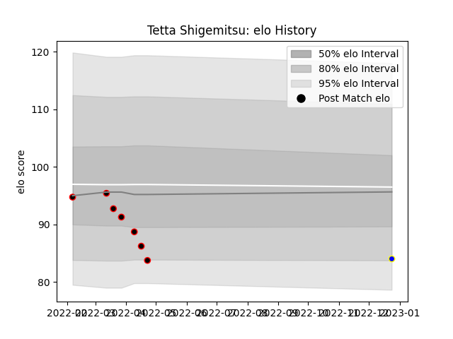

---  
layout: page  
title: Tetta Shigemitsu  
date: 2023-01-17 11:40:12.569553  
categories: player  
---
# Tetta Shigemitsu

## Positions: FL

## Current elo: 93.0

## Current Percentile: 16.0

# Elo History

# Match History

| Team                            |   Appearances |   Win Rate |
|:--------------------------------|--------------:|-----------:|
| NTT Docomo Red Hurricanes Osaka |             7 |   0.142857 |
| Urayasu D-Rocks                 |             2 |   1        |

| Opponent                          |   Matches |   Win Rate |
|:----------------------------------|----------:|-----------:|
| Tokyo Sungoliath                  |         2 |          0 |
| Green Rockets Tokatsu             |         1 |          1 |
| Kubota Spears Funabashi Tokyo-Bay |         1 |          0 |
| Shimizu Blue Sharks               |         1 |          1 |
| Toshiba Brave Lupus Tokyo         |         1 |          0 |
| Toyota Industries Shuttles Aichi  |         1 |          1 |
| Toyota Verblitz                   |         1 |          0 |
| Yokohama Canon Eagles             |         1 |          0 |