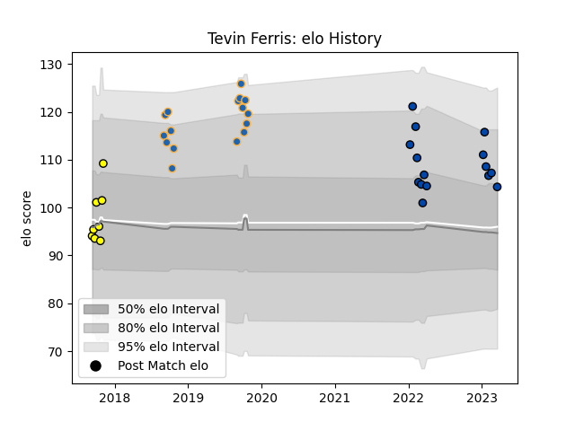

---  
layout: page  
title: Tevin Ferris  
date: 2023-03-21 18:22:21.074377  
categories: player  
---
# Tevin Ferris

Last updated: 2023-03-21
## Positions: FL, N8

## Current elo: 104.0

## Current Percentile: 76.0

# Elo History

# Match History

| Team                |   Appearances |   Win Rate |
|:--------------------|--------------:|-----------:|
| Western Force       |            16 |   0.75     |
| Skyactivs Hiroshima |            15 |   0.133333 |
| Perth Spirit        |             8 |   0.375    |

| Opponent                        |   Matches |   Win Rate |
|:--------------------------------|----------:|-----------:|
| Canberra Vikings                |         5 |   0.4      |
| Brisbane City                   |         4 |   1        |
| Queensland Country              |         4 |   0.75     |
| Fijian Drua                     |         3 |   0.333333 |
| NSW Country Eagles              |         3 |   0.333333 |
| Hanazono Kintetsu Liners        |         2 |   0        |
| Kamaishi Seawaves               |         2 |   0.5      |
| Kurita Water Gush               |         2 |   0.5      |
| Kyuden Voltex                   |         2 |   0        |
| Melbourne Rising                |         2 |   1        |
| Mie Honda Heat                  |         2 |   0        |
| Mitsubishi Dynaboars            |         2 |   0        |
| NTT Docomo Red Hurricanes Osaka |         2 |   0        |
| Sydney Rays                     |         2 |   0.5      |
| Greater Sydney Rams             |         1 |   1        |
| Hino Red Dolphins               |         1 |   0        |