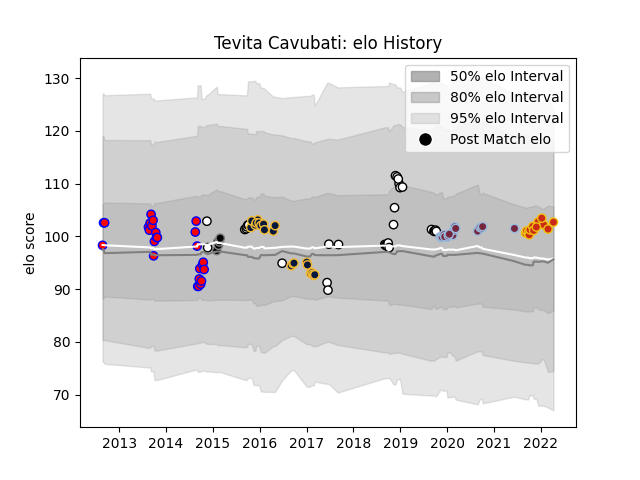

---  
layout: page  
title: Tevita Cavubati  
date: 2023-03-21 18:38:13.760604  
categories: player  
---
# Tevita Cavubati

Last updated: 2023-03-21
## Positions: L

## Country: Fiji

## Current elo: 103.0

## Current Percentile: 65.0

# Elo History

# Match History

| Team               |   Appearances |   Win Rate |
|:-------------------|--------------:|-----------:|
| Tasman             |            26 |   0.75     |
| Worcester Warriors |            23 |   0.195652 |
| Harlequins         |            21 |   0.404762 |
| Fiji               |            19 |   0.473684 |
| Perpignan          |            13 |   0.461538 |
| Newcastle Falcons  |            12 |   0.166667 |
| Ospreys            |             5 |   0.3      |

| Opponent                 |   Matches |   Win Rate |
|:-------------------------|----------:|-----------:|
| Gloucester Rugby         |         8 |   0.25     |
| Bath Rugby               |         6 |   0.5      |
| Sale Sharks              |         5 |   0.1      |
| Wasps                    |         5 |   0.2      |
| Saracens                 |         5 |   0.4      |
| Leicester Tigers         |         5 |   0.3      |
| Canterbury               |         4 |   0.75     |
| Clermont Auvergne        |         4 |   0.25     |
| Worcester Warriors       |         4 |   0.5      |
| Exeter Chiefs            |         4 |   0.25     |
| Bristol Rugby            |         3 |   0.333333 |
| Southland                |         3 |   1        |
| Hawke's Bay              |         3 |   1        |
| Australia                |         3 |   0        |
| Uruguay                  |         3 |   0.666667 |
| Edinburgh                |         3 |   0        |
| Taranaki                 |         3 |   0        |
| Wales                    |         3 |   0        |
| Manawatu                 |         2 |   1        |
| Scotland                 |         2 |   0.5      |
| London Irish             |         2 |   0        |
| La Rochelle              |         2 |   1        |
| Otago                    |         2 |   1        |
| Georgia                  |         2 |   0.5      |
| Toulon                   |         2 |   0.5      |
| Harlequins               |         2 |   0.5      |
| Ulster                   |         2 |   0        |
| Waikato                  |         2 |   1        |
| Counties Manukau         |         2 |   0.5      |
| Biarritz Olympique       |         2 |   1        |
| United States of America |         1 |   1        |
| Tonga                    |         1 |   1        |
| Stade Toulousain         |         1 |   0        |
| Wellington               |         1 |   1        |
| Auckland                 |         1 |   0.5      |
| Leinster                 |         1 |   0.5      |
| Racing 92                |         1 |   0        |
| Pau                      |         1 |   0        |
| Northland                |         1 |   1        |
| Northampton Saints       |         1 |   0        |
| North Harbour            |         1 |   0        |
| Italy                    |         1 |   1        |
| Glasgow Warriors         |         1 |   0        |
| France                   |         1 |   1        |
| England                  |         1 |   0        |
| Dragons                  |         1 |   1        |
| Canada                   |         1 |   1        |
| Brive                    |         1 |   0        |
| Benetton Treviso         |         1 |   0        |
| Bay of Plenty            |         1 |   1        |
| Zebre                    |         1 |   0        |