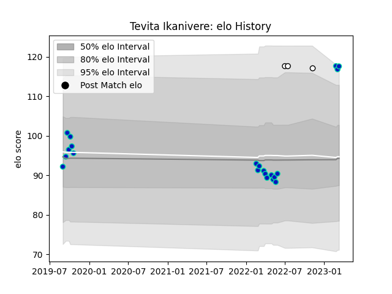

---  
layout: page  
title: Tevita Ikanivere  
date: 2023-03-21 18:12:40.093639  
categories: player  
---
# Tevita Ikanivere

Last updated: 2023-03-21
## Positions: H

## Country: Fiji

## Current elo: 119.0

## Current Percentile: 94.0

# Elo History

# Match History

| Team        |   Appearances |   Win Rate |
|:------------|--------------:|-----------:|
| Fijian Drua |            22 |   0.363636 |
| Fiji        |             3 |   0.333333 |

| Opponent                 |   Matches |   Win Rate |
|:-------------------------|----------:|-----------:|
| New South Wales Waratahs |         3 |        0   |
| Moana Pasifika           |         2 |        1   |
| Canberra Vikings         |         2 |        0   |
| Crusaders                |         2 |        0.5 |
| Melbourne Rebels         |         2 |        0.5 |
| Brumbies                 |         2 |        0   |
| Sydney Rays              |         1 |        1   |
| Scotland                 |         1 |        0   |
| Samoa                    |         1 |        0   |
| Queensland Reds          |         1 |        0   |
| Queensland Country       |         1 |        1   |
| Brisbane City            |         1 |        0.5 |
| NSW Country Eagles       |         1 |        0.5 |
| Melbourne Rising         |         1 |        1   |
| Hurricanes               |         1 |        0   |
| Highlanders              |         1 |        0   |
| Chiefs                   |         1 |        0   |
| Tonga                    |         1 |        1   |